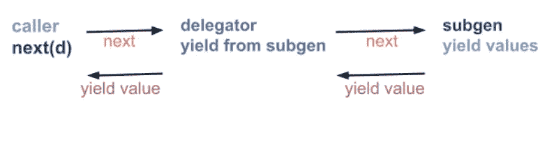
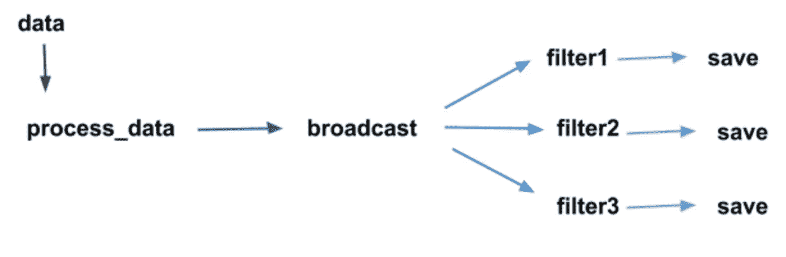

# 屈服于— Python(第四部分)

> 原文：<https://medium.com/nerd-for-tech/yield-from-python-part-iv-5ed4aa2db4b3?source=collection_archive---------3----------------------->


照片由 [Jen Theodore](https://unsplash.com/@jentheodore?utm_source=unsplash&utm_medium=referral&utm_content=creditCopyText) 在 [Unsplash](https://unsplash.com/s/photos/seed?utm_source=unsplash&utm_medium=referral&utm_content=creditCopyText) 上拍摄

我们现在知道了什么是[发电机](/analytics-vidhya/yield-python-part-i-4dbfe914ad2d)，如何[向发电机](https://dkhambu.medium.com/yield-python-part-ii-e93abb619a16)发送数值，以及如何[关闭发电机](https://dkhambu.medium.com/yield-python-part-ii-e93abb619a16)。本文着眼于我们如何使用调用者、使用`yield from`、`yield`和`send`的子生成器进行双向通信。

我们知道如何创造和消费价值。例如。

通过显式调用 next()来使用生成器的数据

输出是:

```
0
1
2
3
4
exhausted...
cleanup...
```

我们甚至可以使用`for`循环从生成器获取值。

通过对 next()的隐式调用使用生成器的数据

输出是:

```
0
1
2
3
4
```

在示例 1 中，我们通过显式调用`next()`来消耗生成器的数据，而在示例 2 中，这是隐式的。这篇文章讲述了迭代的实现是如何完成的。

我们还可以通过使用`yield from`让某种委托者来消费生成器的数据。

获取生成器数据的委托人

输出是:

```
0
1
2
3
4
```

看，我们可以使用`yield from`消耗生成器的值。概略地说，这是控制流程:



发电机管道控制流程

我们还可以用`send()`、`close()`、`throw()`来发电机。

使用委托人向生成器发送值

输出是:

```
Hello world
Value error exception encountered
state: GEN_CLOSED
```

看，我们能够通过使用`yield from`的代理器向生成器发送值和抛出异常。结合这些`yield`、`yield from`、`send`、`throw`语句，我们可以创建一个双向通信。

使用所有这些控制流，我们可以变得更有创造性:



发电机的应用

让我们看看这个代码示例:

在这里，我们处理从生成器获得的数据，并根据数据的属性广播它们，并将它们保存到各自的目的地。

让我们看看保存了值的文件`even.txt`、`odd.txt`和`prime.txt`。

```
even
0
2
4
6
8
10
12
14
```

这就是`odd.txt`的输出。

```
odd
1
3
5
7
9
11
13
```

这就是`prime.txt`的输出。

```
prime
0
1
2
3
5
7
11
13
```

看，我们已经根据过滤器将值从生成器发送到它们各自的目的地。您可以看到一个通用的控制流模式，它生成值，处理值，并广播到它们各自的过滤器以保存它们。在现实世界中，您可能会处理来自远程数据源(如数据库或其他数据存储库)的数据。

总之，您可以通过多个步骤从数据源提取数据或将数据推送到接收器。我们有`yield from`、`send`、`yield`语句来支持该功能。

`yield`系列到此为止。我希望这是一篇有帮助的文章和系列！

我的下一篇文章会在 docker 上！这是我最近一直在修补和努力的东西。到时候见。

保持安全，同时也保护其他人的安全。☮️

灵感:

*   [深潜巨蟒](https://www.udemy.com/course/python-3-deep-dive-part-2/)

你可以在 [Patreon](https://www.patreon.com/dkhambu) 上支持我！