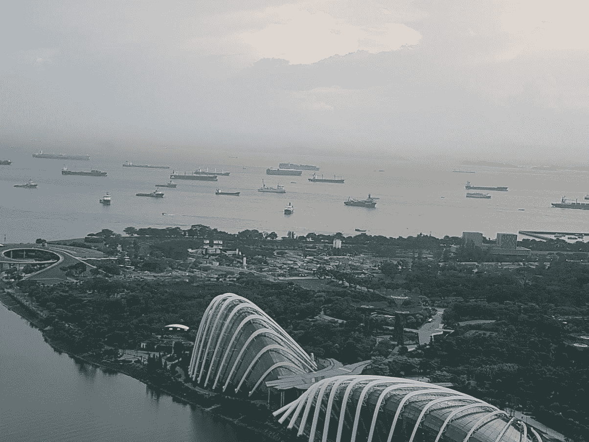
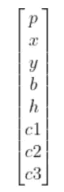
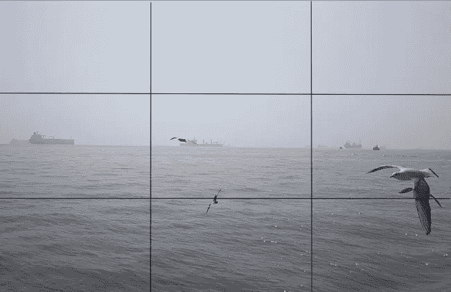
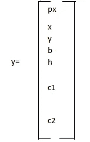
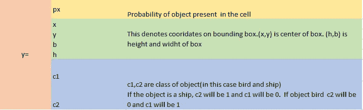
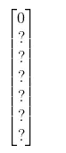
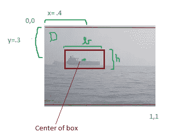
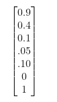
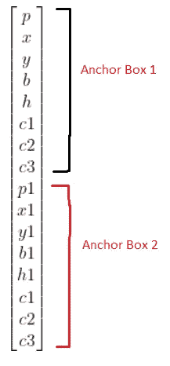
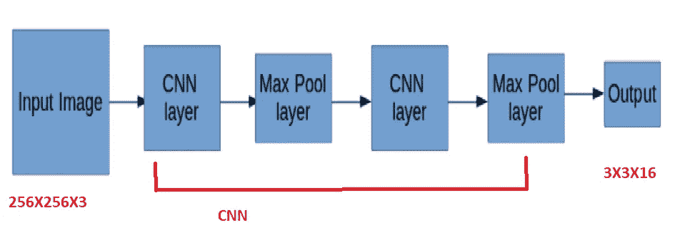

# 你只看一次:物体检测

> 原文：<https://medium.com/nerd-for-tech/yolo-object-detection-70828718bc06?source=collection_archive---------15----------------------->

你只看一次(YOLO)是一个最先进的实时物体检测系统。它使用卷积神经网络(CNN)进行对象检测。

**图像分类 vs 物体检测**

**图像分类**通常指预测图像中存在哪个对象。因此，输入将是包含动物图片的图像集(让我们说斑马，老虎和大象)。输出将把它归类为上述动物之一。动物在图像中的确切位置并不重要。

让我们采取 28X28 的输入图像。使用 RGB 比例它的输入将是 28X28X3 矢量。这将通过卷积神经网络-卷积、最大池和全连接层的组合来处理。最终输出将是 3X1 向量(它将是每一类动物的概率)。对该向量应用 SoftMax 函数将给出图像的准确预测分类。关于 CNN 的更多细节，请点击下面的链接。

 [## CNN 简介

### 什么是 CNN

smverma.medium.com](https://smverma.medium.com/introduction-to-cnn-c42ecc0ad8ff) 

**对象检测**另一方面，预测对象的位置和对象类型。使用与上面相同的例子，CNN 将给出一个向量

1.  如果我们感兴趣的任何对象在那里或不在，即 0，1。
2.  使用对象周围的框的中心和高度和宽度的坐标来定位对象。
3.  c1、c2、c3 用于描述它是哪个对象(我们正在寻找老虎、大象和斑马)

下面是参数向量。这将在**输出矢量部分解释。**

YOLO:背景

YOLO 是 2015 年发表的论文成果— [你只看一次:统一的实时物体检测](https://arxiv.org/abs/1506.02640)。

官方实现由 [DarkNet](https://pjreddie.com/darknet/) 完成，并可在 [github](https://github.com/pjreddie/darknet) 上获得。

**概述**

YOLO 把图像分成不同的区域。然后，它预测该区域中存在物体的可能性。它还预测检测到的对象的边界框。然后，它会消除多个重叠的框，以确保一个对象只被包围在一个框中。

YOLO:步骤

1.  获取输入图像。假设输入图像是 256X256。因此 RGB 比例将被表示为矢量 256X256X3
2.  这个输入图像通过 CNN。
3.  要了解最终预测是如何工作的，让我们先了解我们想要的输出是什么。

**输出向量:**

图像将被划分成多个区域。在本例中，我们将假设输出分为 9 个区域(即 3×3)。假设我们要检测图像中的船和鸟- 2 类物体

船和鸟

因此，对于上面图像网格中的 9 个单元格，我们需要以下输出

一个单元格的输出度量

输出指标的详细信息

下图显示了边界框和相关信息

带边框的网格。

在网格 G 中，由于没有图像，相关联的指标将

在网格 D 中，下图解释了这些数字

h 和 b 通过将它们作为完整图像的高度和宽度的分数来归一化。所以如果 h = .15，b 在归一化后是 0.3

h(归一化)= .15/3=.05，b= .3/3=.1(图像的总尺寸为 3，3)

三维网格度量

盒子的高度和重量可能比它们下面的网格大，但是在使用图像的宽度和宽度进行标准化时，它总是小于 1。

在上述情况下，输出的尺寸将是 3X3X7。

到目前为止，我们看到的是捕捉一个类的图像的网格。但事实并非总是如此。例如在网格 e 中，它既有船又有鸟。为了处理这种情况，使用了“锚箱”。

**锚箱**

假设我们想在每个网格中预测 2 个对象。在这种情况下，out 向量的维数将变为 2X7 =14。矩阵将会像

每个网格可以定义任意数量的锚盒，但通常不超过 5 个。在正常情况下，我们在 19X19 网格中划分输出图像，因此 5 个锚定框是足够的。

**总结**

1.  我们有输入图像，比如说 265X256。CNN 的输入向量是 256X256X3
2.  这是给 CNN 的。
3.  假设:我们希望输出图像为 3X3 网格(通常为 19X19 的良好预测)，每个网格最多 2 个对象(即 2 个锚框)和 3 种要识别的对象类型
4.  CNN 层应该产生 3X3X(2X(1+4+3))= 3X3X(2X 8)= 3X3X 16 的输出向量

5.并集上的交集(IoU)和非最大值抑制:在进行最终消除之前，我们可以消除一些在输出层预测的边界框

**欠条:**

它使用对象的区域预测盒和对象的实际盒来消除预测。如果预测框和实际框的相交面积是 *i* ，那么

*IoU= i/(预测面积+实际面积之和)*

如果这个欠条< *达到某个阈值*我们就可以剔除那个盒子。该阈值通常为 0.5 或更高。

**非最大抑制**

我们排除概率小于某个阈值的盒子。

对于剩余盒子，我们挑选具有最高概率的盒子，并用这个最高概率的盒子消除所有具有高 IoU 的盒子。

对具有下一个最高概率框的框重复相同的过程。

这样做，直到我们有一个盒子围绕着这个物体。

YOLO 的真正威力在于它能探测到物体的速度。下面的视频展示了 YOLO 实时探测物体的能力。

**延伸阅读**

对于物体探测和 YOLO 深潜，请浏览吴恩达的 CNN 课程(第三周-物体探测)

[https://www . coursera . org/learn/卷积神经网络](https://www.coursera.org/learn/convolutional-neural-networks)