# YOLO:你只看一次

> 原文：<https://medium.com/nerd-for-tech/yolo-you-only-look-once-65ea86104c51?source=collection_archive---------8----------------------->

> “你只看一次”，或 YOLO，模型家族是一系列端到端深度学习模型，旨在实现快速对象检测，由 [Joseph Redmon](https://pjreddie.com/) 等人开发，并在 2015 年题为“[你只看一次:统一的实时对象检测](https://arxiv.org/abs/1506.02640)的论文中首次描述

# 什么是 YOLO 物体探测？

YOLO 是一种基于深度学习的物体检测方法。在深度学习领域有两种类型的对象检测算法。这两种类型是:

使用 R-CNN(基于分类的算法)的检测

1.  **基于分类的算法**:这类算法涉及两个步骤。

**第一步**:在图像中选择一组**感兴趣区域(ROI)** ，其中物体出现的几率很高。

**步骤 2** :将**卷积神经网络(CNN)** 应用于第一步中选择的区域，以检测物体的存在。

> 与这些类型的算法相关联的问题是，我们需要在每个 ROI 中执行检测器，这使得对象检测的过程非常慢，并且在计算方面非常昂贵。

1.  **基于回归的算法:**这些类型的算法比上面的算法**快**。没有 ROI 的选择，而是一次性为整个图像预测边界框和标签。这使得检测比分类算法更快。最著名的回归算法之一是 **YOLO(你只看一次)**。自从 YOLO 问世以来，它已经被用于医疗保健、无人驾驶汽车等领域。

使用 YOLO(基于回归的算法)的检测

# YOLO 的工作:快速漫游

> 为什么 YOLO 是如此有用的算法！

*   YOLO 首先把图像作为输入
*   框架把一张照片分成一个 **NxN** 网格的网格。(让我们假设一个 3×3 的网格)

*   现在，在每个网格上应用图像分类和定位的任务。
*   然后，YOLO 算法将分别预测每个对象的包围盒和类别概率。

# 在自定义数据集上训练 YOLO

> 我们将按照以下步骤在自定义数据集上训练 YOLO v5 模型(PyTorch 版本)。
> 
> 数据集:我们在这里选择的数据集是血液对象检测数据集

**克隆 YOLOv5 储存库**

**安装所有必要的依赖项**

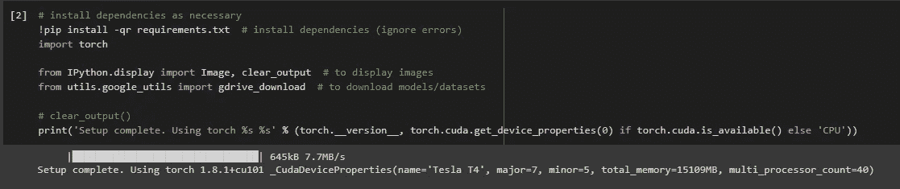

**加载 YOLO v5 (PyTorch)格式的 Roboflow 上标注的自定义数据集。**

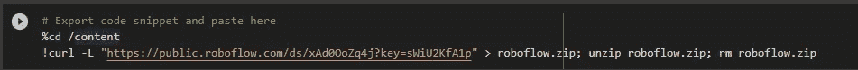

> 这是 Roboflow 编写的 YAML 文件，供公众使用他们的平台来创建带注释的数据集，然后有效地训练 YOLO。

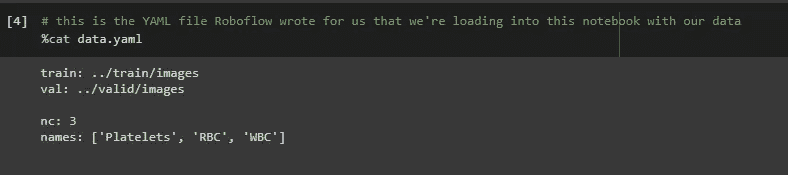

数据集包含 874 幅图像，要检测的对象是血液显微图像中的“血小板”、“白细胞”和“红细胞”。

**定义模型配置和架构**

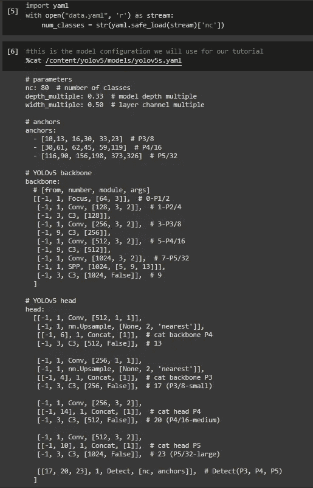

**6。定制 iPython writefile，这样我们就可以编写变量**

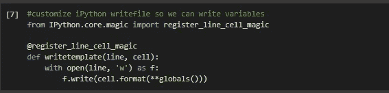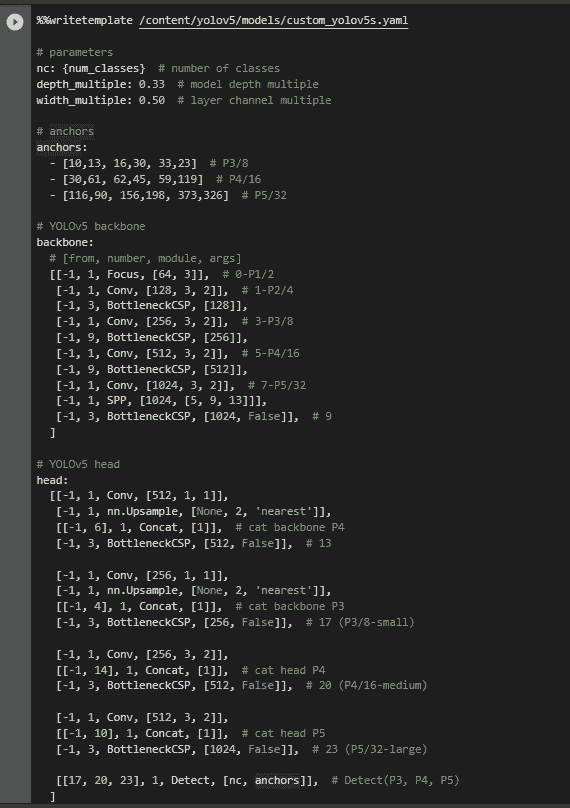

> **使用 Nvidia-smi 检索 gpu 信息和统计数据。在这里，我们使用谷歌实验室，所以我们已经提供了英伟达特斯拉 T4**

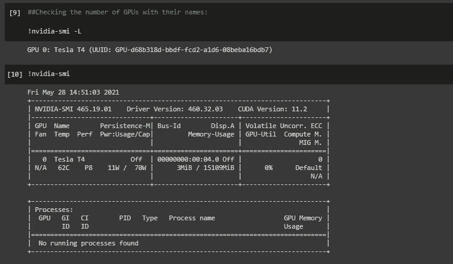

## **模型训练和评估**

现在，我们将开始模型训练和评估。为了评估，我们将使用 ***平均精度图@0.5。***

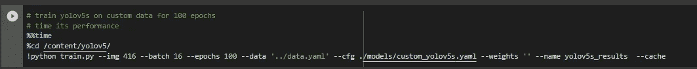

**让我们快速了解一下我们的地面实况数据**

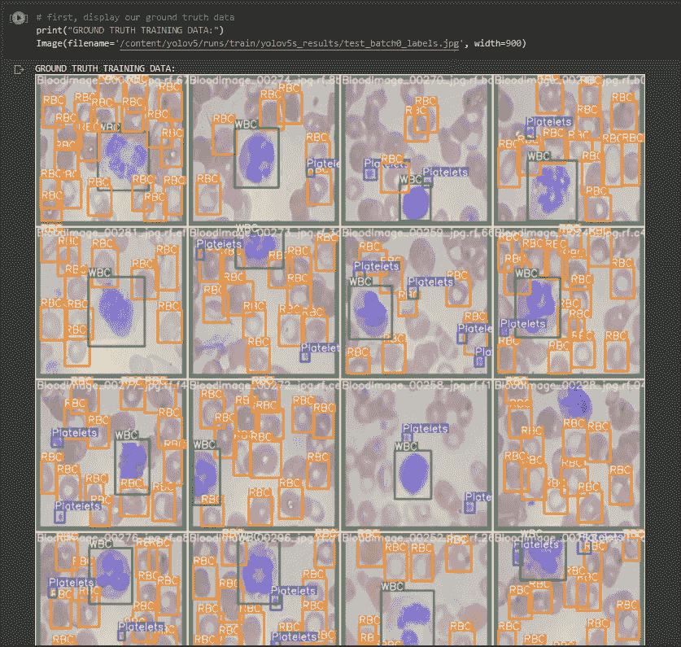

**打印扩充的训练数据**

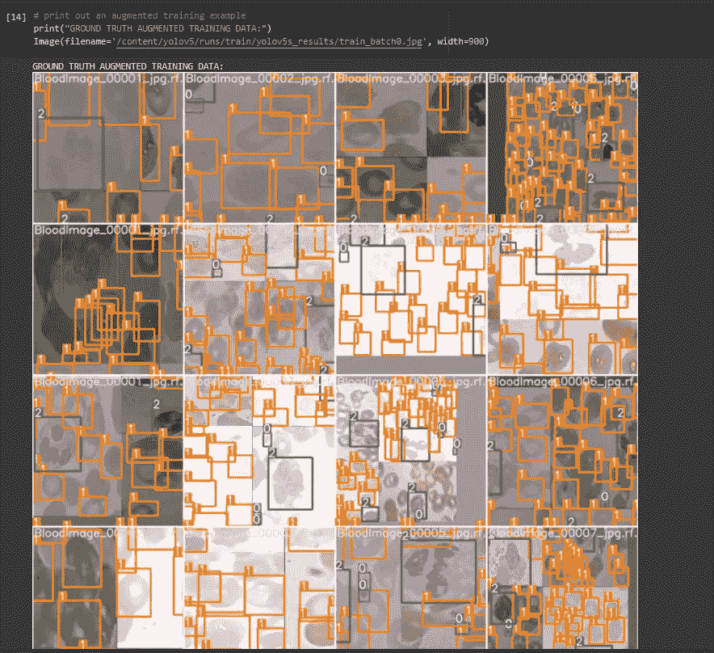

**打印评估结果**

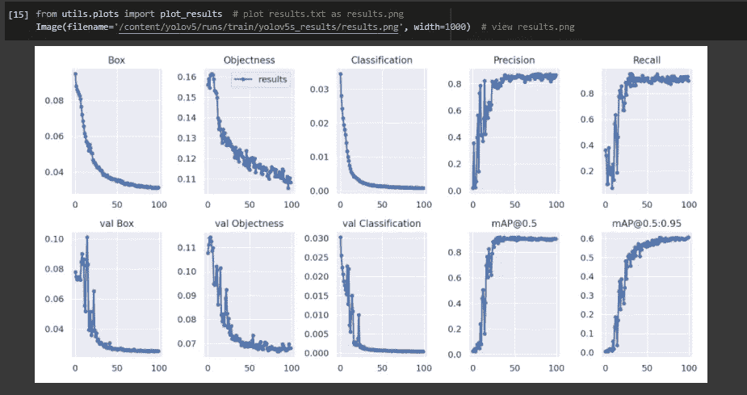

# **结论**

我希望你喜欢训练自定义 YOLO v5 物体探测器！

YOLO v5 是轻量级的，非常容易使用。YOLO v5 训练快，推理快，表现好。