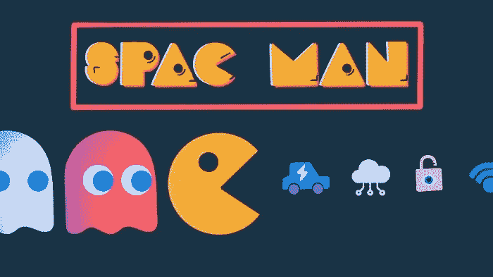

# 你们，创意和技术人员正在做着惊人的工作

> 原文：<https://medium.com/nerd-for-tech/you-creative-and-tech-people-are-doing-amazing-works-225b4ceb2ef7?source=collection_archive---------21----------------------->

图片来源于 [Truunity](https://truunity.com/the-top-11-resources-to-empower-black-brown-people-to-get-into-the-tech-industry/) 发表的这篇关于科技多样性的精彩文章

是的，因为我有机会看到技术的发展和计算机网络的增长，它们驱动着我们今天的经济，人们猜测这不仅会驱动经济，还会因为你在人工智能等每个领域都做了令人惊叹的工作。从由 Html 代码垃圾组成的杂乱网站到现在流行于互联网的反应灵敏的智能应用程序和网络服务，我看到了你所做的伟大工作，下面这张简单的图片向我强调了这一事实，并激励我写下你迄今为止所做的惊人工作。

摘自 [Crunchbase 博客](https://news.crunchbase.com/news/spacs-may-cast-wider-net-as-competition-for-targets-increases/)上发表的[克里斯·梅廷科](https://news.crunchbase.com/news/author/chris-metinko/)的一篇文章

但我希望我们不是在创造一种会扼杀多样性的技术，因为多样性是生活的一个重要特征。我们使用这种新的有效客户开发和产品工程方法来试验和设计我们产品和服务的功能，这种方法比我们从 MBA 中学到的方法更适合初创企业，这种方法是为运营已知商业模式的稳定公司设计的，这让我们认为我们是这样的。因为我们在推广受欢迎的功能，同时扼杀那些在资源有限的情况下没有得到客户或用户足够关注的功能。

PS:一个贫穷的企业家的简短自白，他与非消费和运气竞争，如果你更喜欢“创业”这个名字的话，他现在用了两个风险投资或创业公司。这两个是[书道场](https://medium.com/running-a-publishing-startup)和 [Godda 游戏](/predict/the-business-of-technology-and-10e500c75e77)。感谢所有像 [her](/predict/animes-search-engine-for-mbenda-8aeba1527933) 和 LEGACY 创始人 Ruby L. Taylor 这样的创意和技术人士！你可以在下面看到的纸牌游戏

Google Photo 为我们提供了这个面部检测系统，它可以扩展 Book Dojo 正在进行的发布实验，通过撰写和发布这第 n 篇文章。

你可以在这里支持她的 Kickstarter 项目

**谢谢创意和技术人员**