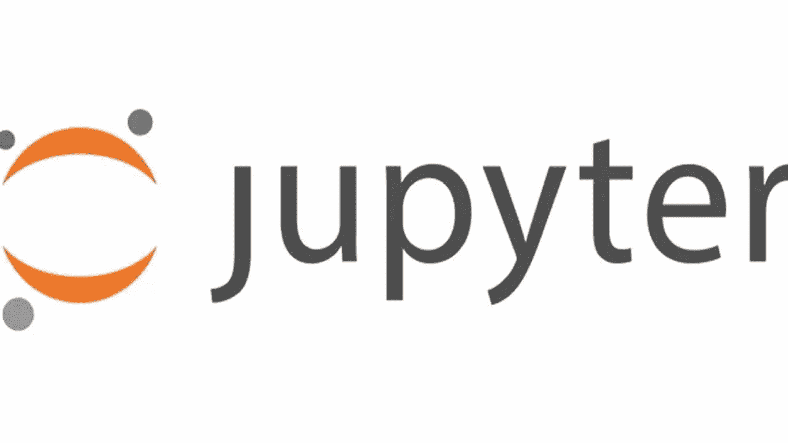

# 你需要小心在 Jupyter 笔记本上打印的内容

> 原文：<https://medium.com/nerd-for-tech/you-need-to-be-careful-on-what-you-print-on-jupyter-notebooks-67840860c3e8?source=collection_archive---------3----------------------->

今天，我用 Jupyter 笔记本应用程序处理一个数据集。

我试图将数据集从一种格式解析为另一种格式。数据集的大小相对较大，大约有 2gb 的文本。

在解析的时候，我**陷入了打印解析后的数据值**的粗心。这导致打印 2gb 文本的重要部分。

这导致**有了一个 200 兆大小的笔记本**。我猜由于里面的信息对应于**数百万条文本行**，浏览器再也无法打开 Jupyter 笔记本了。这意味着我甚至不能复制粘贴我的代码来恢复我的工作。

我不想那样。我想要回我的工作，所以我尝试了一些事情。

# 我尝试过的事情

## 1 单元格->所有输出->清除

我试图清除所有单元输出，然后保存文件。

它没有工作，即使我设法按下“清除”,然后在网页关闭前按下 Ctrl+S。我试了很多次，但是没有希望。

## 2-手动删除行

我知道 Atom 比默认的文本编辑器更好地处理大型文本文件，所以我尝试编辑。ipynb 就像我们会编辑一个. txt 文件，删除不必要的部分。

中滚动了几千多行之后，Atom 崩溃了。ipynb 文件。我不知道它包含多少行，但我改变了文件大小的差异。

从 200 兆字节的文件中减少了 0.5 兆字节，删除了几千行。所以 Atom 不是一个好的解决方案，因为当它加载超过 0.5 兆字节的行时就会崩溃。

## 3-使用 Python 删除线

我认为这可能会做得更好，但是我相信这种方法可以解决我的问题，所以我尝试了特定的解决方案:

*   首先，我创建了损坏文件的备份，以防万一我做错了什么。
*   我已经读过了。ipynb 文件，然后只写回了几行。
*   更明确地说，我没有打开。Jupyter 中的 ipynb 文件。我用 Python 把它作为一个可读可写的文件打开，对它进行修改。就像你用 Python 打开一个. txt 文件一样。
*   第一行和最后一行，我写回了文件。中间的几百万行，我没有回信。

这使得我能够打开。Atom 中的 ipynb，因为文件大小减少到了 2mb。

在那里，我找到了包含代码的相关细胞，复制了代码，我的工作被恢复了。

这是一个基本的问题，但是我觉得很有趣。原来**你需要小心你在 Jupyter 笔记本上打印的内容。**

**注意:**修改 an。ipynb 就像你修改一个. txt 文件一样。ipynb 如果不认真做。因此，在修改之前，请备份您的笔记本。txt，如果你愿意。

