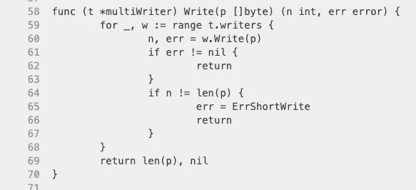

# 您可能不希望在 Go 中为了速度而使用并发

> 原文：<https://medium.com/nerd-for-tech/you-probably-dont-want-that-concurrency-in-go-109421e8d23?source=collection_archive---------6----------------------->

# 序幕

我有机会回顾了一些提交给我公司不同资历的开发人员职位的技术挑战。挑战是写一个简单的命令行实用程序，并在 Go。我不会透露细节，但它涉及到对多个“东西”进行迭代，并对每个“东西”做一些事情。

令我惊讶的是，如此多的申请人在挑战中使用并发性，以努力并行工作。挑战没有要求优化最佳运行时间，并且*肯定*没有要求并行性(尽管我们将大部分方向留给了申请人的自由)。这让我不禁好奇，“为什么会这样？”。

我很快就能得出结论——**因为 Go 中的并发性是*所以*容易**。

如果挑战是在 Python 中，他们会使用`multiprocessing`或`asyncio`库吗？如果是在 Java 里，他们会用`ExecutorService`吗？我不是这些语言的专家，但我对此表示怀疑。

从心理学的角度来看，我其实可以理解他们。即使在围棋中，并发也是一个相对高级的概念，我们可以在技术挑战中更好地表达我们的知识，对吗？:)我过去也站在那一边，也为在围棋中学会这样的优雅而激动不已。不幸的是，在这种情况下，它给我留下了相反的印象。

# 真实交易

好吧，那交易是什么？使用并发性有什么问题，我是说你永远不应该使用它吗？

当我想到并发时，人们可能想使用它有两个主要原因:

*   不能按顺序完成的事情或者更复杂的事情
*   运行时性能

这里我们就讲第二个。

事实是，并发程序比顺序程序引入了更多的复杂性。而且在很多时候，**性能的轻微提升并不值得它所换取的可读性。**

并发程序也伴随着死锁、灵活性降低和其他并发错误的风险。总的来说，它对可维护性有相当大的影响。

但是如果你仍然想做呢？

# 真的会更快吗？

最近我有机会看了一下 [io 的源代码。多作者](https://golang.org/pkg/io/#MultiWriter)。

它可用于将相同的数据写入多个 IO 目的地。例如，在处理 [plum](https://github.com/sanggonlee/plum) 时，我需要将一个 JSON 流写到三个目的地:WebSocket 连接、一个文件和 STDOUT(用于日志记录)。

看到 io 的源代码如此简单，您可能会感到惊讶。MultiWriter 的`Write`方法是:



来源:https://golang.org/src/io/multi.go?#L58

它只是迭代多个编写器并调用它们的`Write`方法。

但是哦不！是顺序的！难道我们不应该并行运行它们以获得尽可能高的性能吗，因为写入字节可能会很昂贵？您应该在 Go source repository 中创建一个 pull 请求来解决这个问题吗？

不需要，我为此创建了一个包: [AsyncMultiWriter](https://github.com/sanggonlee/not_so_impressive_go/blob/master/asyncwriter/multi_writer.go) 。它与 MultiWriter 完全相同，只是每个 Writer 上的`Write`是并发执行的。

以下是 AsyncMultiWriter 和 MultiWriter 之间的基准测试结果，共有 3 个编写器:

```
BenchmarkAsyncMultiWriter_Write_3_writers-8       596774             21188 ns/opBenchmarkMultiWriter_Write_3_writers-8            595705             18871 ns/opBenchmarkAsyncMultiWriter_Write_8_writers-8       150171             66789 ns/opBenchmarkMultiWriter_Write_8_writers-8            267482             63881 ns/opBenchmarkAsyncMultiWriter_Write_20_writers-8       76065            227821 ns/opBenchmarkMultiWriter_Write_20_writers-8            72504            175907 ns/op
```

对于少于 8 个写入者，并行版本比顺序版本慢*。*

*怎么会这样呢？*

*   *首先，每个操作没有*那么*昂贵(写大约 3.6KB)。如果要写的数据更大，异步版本的性能会更好(本杰明·巴罗斯指出了这一点，值得称赞)。*
*   *第二，并发的 CPU 密集型工作可能没有你想象的那么好。性能提升来自于通过并行方式利用多个内核。但也来源于 go routine 之间的屈服(即[协程](https://en.wikipedia.org/wiki/Coroutine))。在这种情况下，每个操作都将忙于写数据，没有机会让位于其他 goroutines。*
*   *第三，进程间的通信总会有开销——例如同步、访问共享资源等。这对于小规模的运营尤其不利。*

*第二点告诉我们，当您运行多个*阻塞操作*时，您将从并发性中获益更多。例如，假设您正在为昂贵的 API 发送多个 HTTP 请求。并发运行它们会有所帮助，因为当一个进程等待响应并空闲时，它可以进行上下文切换，并将 CPU 用于其他进程。*

# *外卖食品*

*以下是 TLDRs:*

*   *在诉诸并发之前，先采用更简单、可读性更强的解决方案。*
*   *如果您确实需要优化性能，请始终进行基准测试。根据各种输入参数对顺序版本和并发版本进行基准测试。根据要处理的项目数量以及处理每个项目的成本，结果可能会有很大差异。*
*   *关于何时使用并发的一个很好的经验法则是:每个进程会阻塞(空闲等待)很长时间吗？*

*如果你还没有这样做，我强烈推荐你观看罗布·派克的演讲。这是一个令人惊叹的演讲，如果你对并发性的理解不是 100%，你会学到很多东西。*

*感谢您的阅读。*