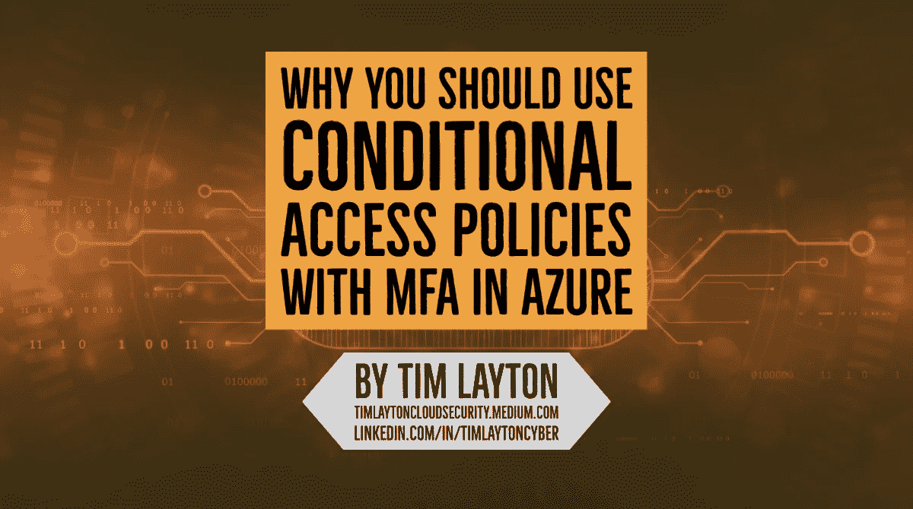
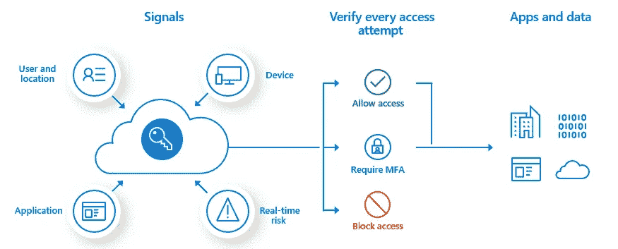
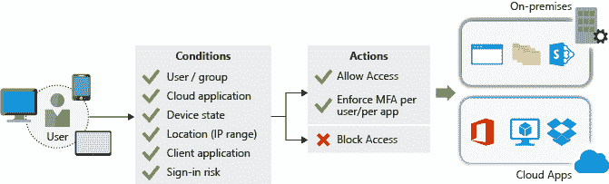

# 您应该在 Microsoft Azure 云环境中使用带有多因素身份验证的条件访问策略

> 原文：<https://medium.com/nerd-for-tech/you-should-be-using-conditional-access-policies-with-multi-factor-authentication-in-microsoft-2b450f25cae?source=collection_archive---------7----------------------->

对于当今云中的许多场景，**多因素身份认证(MFA)** 根本不够。我最近写了一篇[文章](https://timlaytoncloudsecurity.medium.com/multi-factor-authentication-mfa-isnt-enough-any-more-in-cloud-environments-9fe2bd292ae2)，回顾了为什么 MFA 在公共云环境中不再足够。

在 Azure 中，你可以结合使用**条件接收策略**和 **MFA** 来帮助给特权账户增加一层最低限度的保护。请参考下图了解概念性概述。

有了条件访问策略，您可以阻止来自可疑 IP 地址的登录，拒绝来自没有恶意软件保护的设备的访问，甚至限制来自危险登录的访问。

在讨论条件接收策略的更多细节之前，我将快速回顾一下多因素身份验证(MFA)。

**多因素认证(MFA)**

大多数 IT 和安全专业人员认为，当您希望通过要求两个或更多元素来进行完全身份验证的**来增加身份的安全性时，多因素身份验证(MFA)是一个不错的选择**。这些元素分为三类:

*   你知道的东西:密码或安全问题的答案。
*   你有的东西:接收通知的移动应用程序或令牌生成设备。
*   你是什么:某种生物特征，如在许多移动设备上使用的指纹或面部扫描。

很容易理解使用 MFA 如何提高云中身份的安全性并限制凭据泄露的潜在影响。

当使用 MFA 时，威胁参与者不仅需要知道用户的密码，还需要物理接触他们的电话或用户的脸，以便进行完全的身份验证。只有国家行为者有技能和能力绕过这些类型的额外安全措施。

在公共云中，单因素身份认证(仅密码)对于任何用户来说都是不够的，我认为对于特权帐户来说是危险的。在 Azure 中启用 MFA 非常简单。

Azure AD 内置了多因素身份验证功能，因此实现起来再简单不过了。它还可以与各种多因素身份认证提供商集成。

**Azure 条件接收政策**

除了上述多因素身份验证(MFA)之外，**确保在授权访问之前满足附加要求可以增加另一层保护**。

通过条件访问策略，您可以阻止来自可疑 IP 地址的登录，或者拒绝来自没有恶意软件保护的设备的访问，甚至限制来自危险登录的访问。

> Azure Active Directory 提供基于组、位置或设备状态的条件访问策略。

条件访问策略中的位置功能允许您的组织区分不属于网络的 IP 地址，并且它满足了安全策略要求从定义的位置和地址块进行多因素身份验证的要求。

例如，您可以创建一个条件访问策略，要求从企业网络外部的 IP 地址请求访问您的 Azure 托管 web 应用程序的用户接受多因素身份验证质询。

在下图中，您可以看到当用户请求访问您的云甚至现场应用程序时，会评估一系列条件并通过策略强制执行。根据定义的条件，用户要么被允许访问，要么被强制进行多因素身份认证，要么被阻止。

蒂姆·雷顿

Tim Layton 专门为整个企业的业务利益相关者解释与云计算安全和风险管理相关的复杂性和技术术语。Tim 是云安全领域的思想领袖，他定义了可操作和可防御的战略，以帮助企业利益相关方做出基于风险的决策，并对新数字前沿的投资进行优先排序。

> *中等:*[https://timlaytoncloudsecurity.medium.com](https://timlaytoncloudsecurity.medium.com/)
> 
> *领英:*[*https://LinkedIn.com/In/TimLaytonCyber*](https://linkedin.com/In/TimLaytonCyber)

# **资源**

[微软 Azure 多因素认证](https://docs.microsoft.com/en-us/azure/active-directory/authentication/concept-mfa-howitworks)

[微软 Azure 条件接收政策](https://docs.microsoft.com/en-us/azure/active-directory/conditional-access/overview)

# 常见风险术语和定义

**威胁:**任何可能通过信息系统对组织运营(包括使命、职能、形象或声誉)、组织资产、个人、其他组织或国家造成不利影响的情况或事件，包括未经授权的访问、破坏、披露或修改信息，和/或拒绝服务。(NIST 800–30)

**威胁:**意外事件的潜在原因，会对系统或组织造成损害。(ISO 27001)

**漏洞:**信息系统、系统安全程序、内部控制或实施中可能被威胁源利用的弱点。(NIST 800–30)

**漏洞:**可被一个或多个威胁利用的资产或控制的弱点。(ISO 27001)

**可能性:**基于给定威胁能够利用给定漏洞或一组漏洞的概率的主观分析的加权因子。(NIST 800–30)

可能性:某事发生的可能性。(ISO 27001)

**风险:**衡量一个实体受到潜在环境或事件威胁的程度，通常是以下因素的函数:( I)如果环境或事件发生，将会产生的不利影响；和(ii)发生的可能性。(NIST 800–30)

**风险:**不确定性对目标的影响。(ISO 27001)

**安全控制:**为保护信息系统及其信息的机密性、完整性和可用性而对信息系统规定的管理、操作和技术控制措施(即安全措施或对策)。(NIST 800–30)

**补偿安全控制:**组织采用的一种管理、操作和/或技术控制措施(即安全措施或对策),代替低、中或高基线中的推荐安全控制措施，为信息系统提供同等或可比的保护。(NIST 800–30)

**影响等级:**未授权的信息披露、未授权的信息修改、未授权的信息销毁、信息丢失或信息系统可用性丧失的后果可能导致的危害程度。(NIST 800–30)

**剩余风险:**应用安全措施后剩余的风险部分。(NIST 800–30)

**安全态势:**基于信息保障资源(例如，人员、硬件、软件、策略)和能力的企业网络、信息和系统的安全状态，以管理企业的防御并随着情况的变化做出反应。(NIST 800–30)