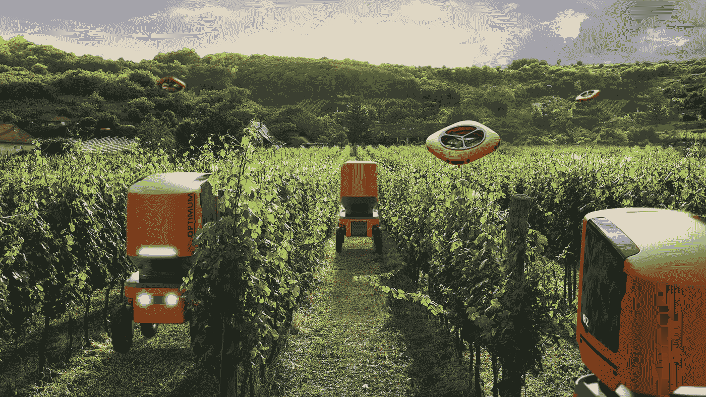

# 你还怀念 QQ 农场偷菜，AI 技术早就开始种菜了

> 原文：<https://medium.com/nerd-for-tech/you-still-miss-qq-farm-stealing-vegetables-ai-technology-has-already-begun-to-grow-vegetables-78b92dd10cb7?source=collection_archive---------6----------------------->

[https://www . puxiang . com/galleries/12c 7190 d7d 5757 a 723 deb 4671 DC 7136 f](https://www.puxiang.com/galleries/12c7190d7d5757a723deb4671dc7136f)

很多现在 30 多岁、20 多岁的中国人已经为网络游戏 QQ 农场疯狂，设置闹钟偷菜，甚至深夜看各种攻略和帖子，以提高农场的产量。

然而，当很多人还在怀念那些为 QQ 农场疯狂的日子时，已经有人在现代化的农场里使用类似 QQ 农场的技术进行农业生产和生活了。那就是“AI 农场”其实“AI 农场”这个词是编辑为了让大家更容易理解而说的。通俗地说，就是利用人工智能技术**监测环境数据、农作物生产状况、市场需求**等。在农业生产的早期、中期甚至后期，生产、种植和销售农作物。

## **AI 技术在农业生产中的突出表现**

AI 技术监测控制区域的空气湿度和植物需水量，并设定合理的灌溉水量。根据实际情况，采用**自动灌溉、定时加湿、定时灌溉**等方式，保证作物需水量，节约灌溉用水。它们还保证了作物生长所需的水，避免了作物生长期间因灌溉水不足或过多而导致的干旱和洪水的发生。

尽管无土栽培技术在许多农业生产中得到应用，但土壤在很大程度上仍是作物生产的“主场”。 **AI 技术检测分析土壤成分，选择适合种植的作物品种**，使用有效肥料，节约资源，改善口感，提高产量。同时，AI 技术通过分析土壤，帮助人们获得合理的施肥时间和地点，从而实现高生产率，节约成本。

种子的质量直接影响农作物的生长。**人工智能技术检测种子图像和神经网络，而不破坏种子结构**。检测速度快，准确率高，对提高农产品的产量和品质有着重要的作用。

在大数据的统计下，AI 还可以预测作物生长过程中可能出现的问题，并基于作物生长环境数据和生长状态数据的统计，提供相应的解决方案。通过对作物生长环境中的温度、湿度、二氧化碳含量、水分等因素的检测和自动感知，及时做出调整，采取控温、遮光、灌溉等措施，保证作物的有效生长。AI 技术还可以实现**智能预防，管理害虫杂草，减少经济损失**的目标。

就像 QQ 农场里鼠标点一下种菜的操作一样，AI 技术已经大量付诸实践了。

在第一届和第二届国际智能温室种植挑战赛中，人工智能技术被用于成功种植黄瓜和西红柿。顺便说一下，第三届国际智能温室种植挑战赛正在进行中。人工智能技术将被用于种植生菜。这是烧烤的必备之一。也许在不久的将来，我们烧烤桌上的生菜将全部由 AI 技术种植。

随着世界人口压力越来越大，土地和环境污染越来越严重，人工智能技术在农业生产中的应用已经成为共识。然而，人工智能技术与传统农业的结合也面临着许多挑战和问题。如何预测和克服这些困难将是我们共同面临的问题，需要我们共同探索 AI 技术的各种可能性。

## **数据标签需求持续增长**

目前研究界正在做无监督、小样本的深度学习工作。通过三维合成数据，用合成数据训练机器，尽量减少数据采集和标注过程。这样机器就可以自主学习和进化。然而，由于缺乏理论上的技术突破，虽然技术发展很快，但总体水平仍然较低。目前的深度学习仍然依赖于基于统计显著性的大数据模型，需要可扩展的数据。

# 结束

将您的数据标注任务外包给[字节桥](https://tinyurl.com/43462nse)，您可以更便宜、更快速地获得高质量的 ML 训练数据集！

*   无需信用卡的免费试用:您可以快速获得样品结果，检查输出，并直接向我们的项目经理反馈。
*   100%人工验证
*   透明和标准定价:[有明确的定价](https://www.bytebridge.io/#/?module=price)(包含人工成本)

为什么不试一试呢？

资料来源:https://xw.qq.com/cmsid/20210906A06QXL00