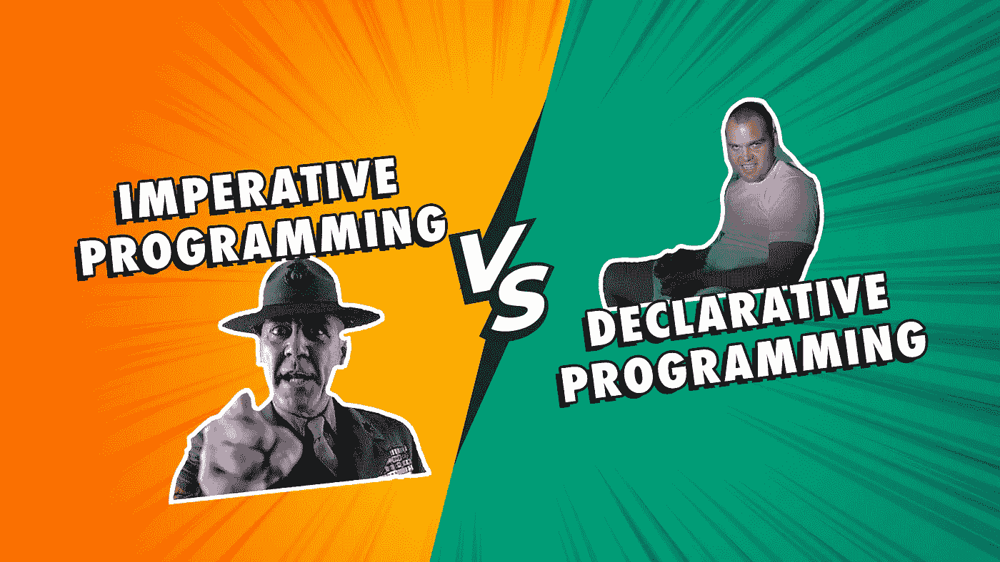

# 你的声明式与命令式编程指南

> 原文：<https://medium.com/nerd-for-tech/your-awesome-guide-to-declarative-vs-imperative-programming-1ef03bb48e96?source=collection_archive---------5----------------------->

## 用非凡的隐喻和可怕的例子。

背景由 [starline](https://www.freepik.com/starline) 经由 [FreePik](https://www.freepik.com/free-vector/comic-style-versus-vs-banner-yellow-turquoise-color_8152293.htm#page=1&query=Versus&position=2) ，由[作者](http://www.arnoldcode.com)调整

当你开始学习编程时，你正忙于学习基础知识。关键词、变量、控制语句、循环很重要，但不如学习如何将现实生活中的问题转化为代码解决方案重要。