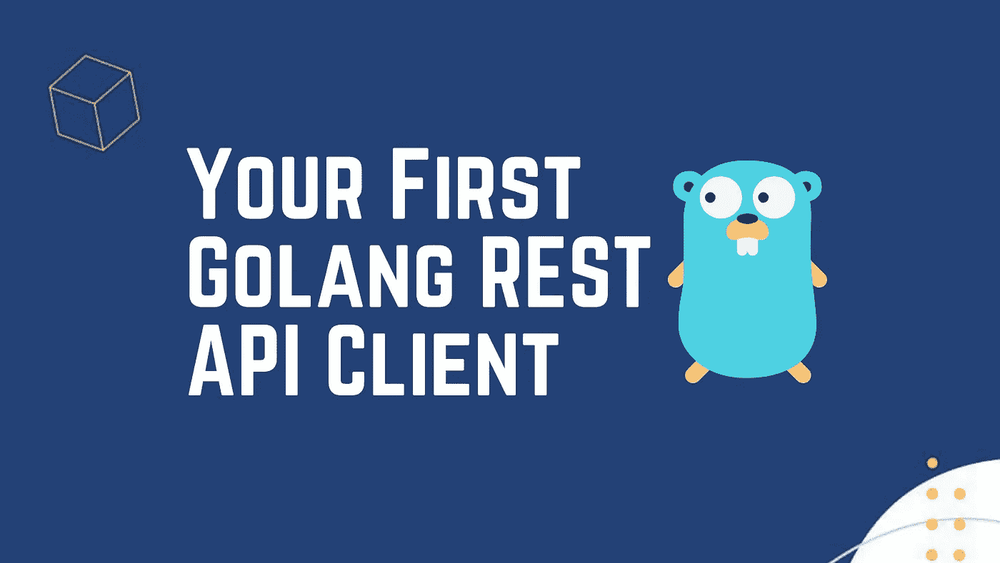

# 您的第一个 Golang REST API 客户端

> 原文：<https://medium.com/nerd-for-tech/your-first-golang-rest-api-client-287c8dc0961?source=collection_archive---------0----------------------->



在本教程中，我们将帮助您设置您的环境，编写一个程序从 REST API 请求数据，解析数据，并将其输出到控制台。如果你已经安装了 Golang，那么你可以跳过本教程的第一部分，直接跳到编码部分。

本教程涵盖了获取 RESTful API 的实时外汇数据，但也可以适用于任何提供 JSON 数据的 API。

关于 WebSocket 实现，请阅读[你的第一个 Golang Websocket: FX 数据](/nerd-for-tech/your-first-golang-websocket-fx-data-fc1eb7db35f0)

首先，下载并安装 Golang

首先，从 https://golang.org/doc/install[下载并安装 Golang，一旦你运行了 GoLang，你可以打开一个命令窗口，输入下面的命令，你会得到版本输出。](https://golang.org/doc/install)

```
go -versiongo version go1.17.1 windows/amd64
```

获取您的 API 密钥

这个程序你需要的最后一样东西是你的 TraderMade API 密匙，如果你没有，你可以[免费注册](https://marketdata.tradermade.com/signup)，然后你可以从你的[仪表盘](https://marketdata.tradermade.com/myAccount)上复制它。

好了，我们写点代码吧。

首先，我们需要添加一些包名，我将使用“main ”,然后我们将导入一些我们将要使用的包，encoding/json 将帮助解析 json，fmt 将帮助打印语句，io/ioutil 将允许程序基本的读写命令，log 这用于将消息记录到控制台，以便我们可以看到程序正在做什么，net/http 这将允许我们对 REST 服务进行 get 调用。

```
package main import ( "encoding/json"
    "fmt"
    "io/ioutil"
    "log"
    "net/http" )
```

然后我们添加主函数。这将是程序的入口点，在这个主函数中，我们将首先定义货币参数、api_key 参数和 URL。下面的 api_key 有一个字符串“your_api_key ”,您应该在其中插入您的 api_key。

```
func main(){ currencies := "EURUSD,GBPUSD" api_key := "your_api_key" url := "https://marketdata.tradermade.com/api/v1/live?currency=" + currencies + "&api_key=" + api_key }
```

现在我们要添加一个 http。使用我们在上一步中定义的 url 获取请求。我们还将添加一些错误捕捉代码，这些代码将检查在我们进行 Get 调用时设置的 getErr 变量，如果该变量为空，我们将继续，否则我们将记录一个错误。

```
resp, getErr := http.Get(url)
  if getErr != nil {
        log.Fatal(getErr)
  }
```

接下来，我们检查了从 Get 调用中收到的一些数据，我们将使用 ioutil 检索请求体。ReadAll 函数。我们再次检查 res.Body 中的错误。

```
body, readErr := ioutil.ReadAll(res.Body)
  if readErr != nil {
      log.Fatal(readErr)
    }
```

现在，我们需要解析 JSON 主体，但在此之前，我们需要理解它是由什么组成的。为此，只需打印我们在 main 函数中收到的主体字符串。

```
func main(){
    currencies := "EURUSD,GBPUSD"
    api_key := "your_api_key"
    url := "https://marketdata.tradermade.com/api/v1/live?currency=" + currencies + "&api_key=" + api_key resp, getErr := http.Get(url)
    if getErr != nil {
      log.Fatal(getErr)
    } body, readErr := ioutil.ReadAll(res.Body)
    if readErr != nil {
      log.Fatal(readErr)
    } fmt.Println(string(body))   }
```

并在命令终端中使用命令 go run“main.go”运行该文件(我们已经将文件保存为 main . go)。

```
{
   "endpoint": "live",
   "quotes": [
    {
     "ask": 1.15537,
     "base_currency": "EUR",
     "bid": 1.15536,
     "mid": 1.15536,
     "quote_currency": "USD"
    },
    {
     "ask": 1.3621,
     "base_currency": "GBP",
     "bid": 1.36208,
     "mid": 1.36209,
     "quote_currency": "USD"
    }
   ],
   "requested_time": "Tue, 12 Oct 2021 11:34:26 GMT",
   "timestamp": 1634038467
}
```

你现在可以在上面看到我们收到的 JSON 正文。然而，这只是一个字符串，如果您正在处理对象，它并不十分有用。由于 Golang 是一种强类型语言，我们需要做一些工作才能解析收到的数据。我们首先必须定义我们想要写入响应体的数据结构。正如你所看到的，下面的数据结构与我们上面打印的数据相匹配

```
type data struct {
      Endpoint       string                   `json:'endpoint'`
      Quotes         []map[string]interface{} `json:'quotes'`
      Requested_time string                   `json:'requested_time'`
      Timestamp      int32                    `json:'timestamp'`
  }
```

尽管大部分都很简单，但理解数据结构中的引号是如何定义的还是很有帮助的。

我们将引号定义为[]map[string]interface{}，用简单的语言来说，这意味着一个映射数组，其中键是字符串类型，值是未知类型。map 只是一个带有键和值的 JSON 对象(类似于 Python 中的字典)，但是在 Golang 中我们必须定义它。接口是一个略有不同的概念，但通常在值类型未知时用于解析 JSON。

现在我们已经定义了数据结构，这是很重要的一点，我们只需要将它解组到内存中的一个对象中。为此，我们将为数据结构分配一个名为 data_obj 的变量，然后对接收到的数据进行解组。

```
data_obj := data{} jsonErr := json.Unmarshal(body, &data_obj)
  if jsonErr != nil {
     log.Fatal(jsonErr)
  }
```

现在我们将打印解析后的值，并在需要时使用它们。我们将简单地打印所有的值，并迭代前面定义的引号。

```
fmt.Println("endpoint", data_obj.Endpoint, "requested time", data_obj.Requested_time, "timestamp", data_obj.Timestamp) for key, value := range data_obj.Quotes { fmt.Println(key) fmt.Println("symbol", value["base_currency"]+value["quote_currency"], "bid", value["bid"], "ask", value["ask"],
"mid", value["mid"]) }
```

我们现在可以看到，我们已经打印了在数据结构中定义的所有值。现在使用这些键和值应该相当简单。

```
endpoint live requested time Tue, 12 Oct 2021 17:40:05 GMT timestamp 1634060405
0
symbol EUR USD bid 1.15256 ask 1.15256 mid 1.15256
1
  symbol GBP USD bid 1.35834 ask 1.35836 mid 1.35835
```

下面是 Golang 的完整代码，可以复制粘贴以开始获取实时外汇和 CFD 数据。请记住从您的[仪表板](https://marketdata.tradermade.com/myAccount)添加您的 API 密钥。希望这篇文章有助于在 Golang 中解析 JSON REST API。如果你喜欢我们的工作或对未来的文章有建议，请留下评论并鼓掌，我们希望听到你的声音。

```
package mainimport ( "encoding/json"
    "fmt"
    "io/ioutil"
    "log"
    "net/http")type data struct {
      Endpoint       string                   `json:'endpoint'`
      Quotes         []map[string]interface{} `json:'quotes'`
      Requested_time string               `json:'requested_time'`
      Timestamp      int32                    `json:'timestamp'`
  }func main(){
      currencies := "EURUSD,GBPUSD"
      api_key := "your_api_key"
      url := "https://marketdata.tradermade.com/api/v1/live?currency=" + currencies + "&api_key=" + api_key resp, getErr := http.Get(url)
      if getErr != nil {
        log.Fatal(getErr)
      } body, readErr := ioutil.ReadAll(res.Body)
      if readErr != nil {
        log.Fatal(readErr)
      } fmt.Println(string(body))      data_obj := data{} jsonErr := json.Unmarshal(body, &data_obj)
      if jsonErr != nil {
         log.Fatal(jsonErr)
      } fmt.Println("endpoint", data_obj.Endpoint, "requested time", data_obj.Requested_time, "timestamp", data_obj.Timestamp) for key, value := range data_obj.Quotes { fmt.Println(key) fmt.Println("symbol", value["base_currency"]+value["quote_currency"], "bid", value["bid"], "ask", value["ask"],
      "mid", value["mid"]) } }
```