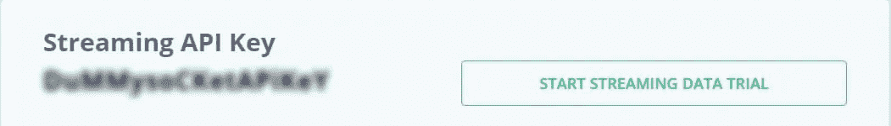
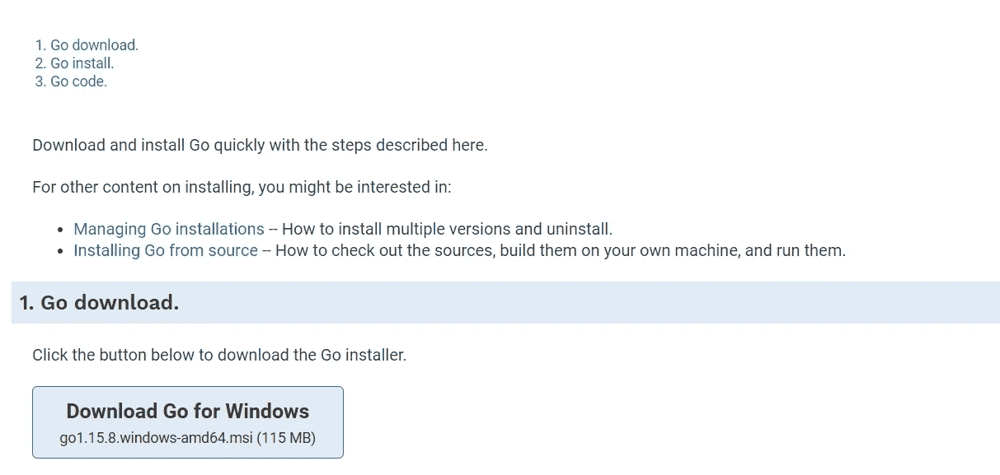
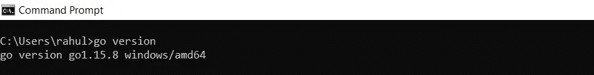
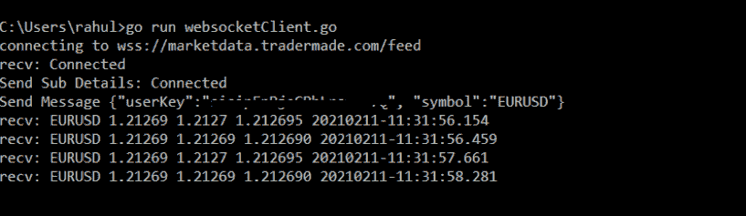

# 你的第一个 Golang Websocket: FX 数据

> 原文：<https://medium.com/nerd-for-tech/your-first-golang-websocket-fx-data-fc1eb7db35f0?source=collection_archive---------5----------------------->

听说了很多围棋(Golang)的事，决定试一试。由于我的专业领域在于处理实时外汇数据，所以我决定使用 Go 提取实时外汇数据。如果 Go 不合你的胃口，如果你感兴趣的话，可以使用 Websocket 的其他实现，如 [Python](https://rahul-khanna.medium.com/your-first-python-socketio-client-506b3c2e9187) 、 [C#](https://khanna-rahul.medium.com/your-first-c-websocket-client-5e7acc30681d) 和 [NodeJS](/nerd-for-tech/stream-real-time-forex-data-with-nodejs-websocket-9fb9b1c2e048) 。

这是我的发现。

1.  这可能是最容易设置的。
2.  并且很少或没有问题地工作。

我相信很多围棋和其他语言的专家都不同意我的第二点。我自己喜欢 Python，尽管以上两点不是它的强项(我可能又做了一次)。

在我们开始一些要求之前，你需要事先编程知识，互联网连接和电子邮件地址。

对于 JSON REST API，请阅读[您的第一个 Golang REST API 客户端](/nerd-for-tech/your-first-golang-rest-api-client-287c8dc0961)

我们开始吧

**获取 Websocket API 密钥**

在我们设置 Go 环境之前，让我们从[https://marketdata.tradermade.com/signup](https://marketdata.tradermade.com/signup)获取我们的外汇 WebSocket API 密钥。它是免费的。

一旦你登录到你的账户，生成你的 API 密匙，并保持等待状态。



**设置环境**

首先，从 https://golang.org/doc/install 下载并安装 Go



这是三个简单的步骤。

安装完成后，打开命令提示符，写下:

```
go version
```



安装依赖项

```
go get github.com/gorilla/websocket
```

你现在必须跑了！

**去跑步**

让我们写一些代码，我们将从创建基本程序开始。main()函数将在程序运行时被调用，我们还将导入我们需要的库。对于本例，我们将使用以下内容:

```
// +build ignorepackage mainimport (
  "log"
  "net/url"
  "os"
  "os/signal"
  "time"
  "github.com/gorilla/websocket"
)
func main() {
//Add progrma content here 
}
```

我们将向其中添加几个变量，一个用于存储输入消息，另一个用于在程序终止时处理中断事件。这些变量是消息传递的通道，类似于其他语言中的缓冲区。在 Go 中，通道可以是双向的，也可以是单向的。我们还将在我们的中断变量中添加一个信号通知程序，这样当程序终止时，我们可以很好地进行清理。

```
messageOut := make(chan string)
interrupt := make(chan os.Signal, 1)
signal.Notify(interrupt, os.Interrupt)
```

现在我们将为 WebSocket 服务器的连接创建我们的 URL，我们将输出它以便我们可以检查 URL。

```
u := url.URL{Scheme: "wss", Host: "marketdata.tradermade.com", Path: "/feedadv",}
log.Printf("connecting to %s", u.String())
```

接下来，我们将编写一些代码来建立与服务器的连接，并处理连接的不同结果。在创建时，我们会查找错误，如果发现错误，我们会向用户显示一条消息。本节的最后一行添加了“defer c.Close()”这是对程序说的，当这个函数完成时，在这个连接上调用 Close()。第一个 defer 将最后执行，将其视为堆栈中最后执行的内容。

```
c, resp, err := websocket.DefaultDialer.Dial(u.String(), nil); if err != nil {
    log.Printf("handshake failed with status %d", resp.StatusCode)
    log.Fatal("dial:", err)
  }
  //When the program closes close the connection
  defer c.Close()
```

现在我们将编写处理连接的函数，这是一个 goroutine，所以异步运行，从提要中读取流程。在循环过程中，它使用 c 读取消息。ReadMessage()返回一条消息或一个错误。收到错误时，代码打印错误并退出，收到消息时，检查是否是连接消息，如果是，则返回一个字符串，其中包含 user_key 和所需的符号。一旦发送完毕，你将会收到一条回复给客户的价格信息。在本例中，我们只是将消息打印到屏幕上，但是您需要在这里处理消息数据。

```
done := make(chan struct{})
  go func() {
    defer close(done)
    for {
      _, message, err := c.ReadMessage()
      if err != nil {
        log.Println("read:", err)
        return
      }
      log.Printf("recv: %s", message)
      if string(message) == "Connected"{
        log.Printf("Send Sub Details: %s", message)
        messageOut <- "{"userKey":"YOUR_API_KEY", "symbol":"EURUSD"}"
      }
    }
  }()
```

这个程序的最后一部分看起来很复杂，但实际上非常简单。这是一个常量循环，用于保持程序运行，因为 goroutine 是异步的，它不会锁定主线程，所以如果没有这个部分，程序就会返回，你的 feed 处理程序就会停止。

```
ticker := time.NewTicker(time.Second) defer ticker.Stop() for { select { case <-done: return case m := <-messageOut: log.Printf("Send Message %s", m) err := c.WriteMessage(websocket.TextMessage, []byte(m)) if err != nil { log.Println("write:", err) return } case t := <-ticker.C: err := c.WriteMessage(websocket.TextMessage, []byte(t.String())) if err != nil { log.Println("write:", err) return } case <-interrupt: log.Println("interrupt") // Cleanly close the connection by sending a close message and then // waiting (with timeout) for the server to close the connection. err := c.WriteMessage(websocket.CloseMessage, websocket.FormatCloseMessage(websocket.CloseNormalClosure, "")) if err != nil { log.Println("write close:", err) return } select { case <-done: case <-time.After(time.Second): } return } }
```

现在，我们可以将所有代码放在一起，并设置您的 API _KEY，将文件保存为 websocketClient.go

然后从终端运行以下命令来运行您的代码:

```
go run websocketClient.go
```



你可以看到实时价格。现在，您已经成功地运行了第一个 Websocket 客户端来提取 FX 数据。

完整的应用程序代码:

```
// +build ignore package mainimport (
  "log"
  "net/url"
  "os"
  "os/signal"
  "time"
  "github.com/gorilla/websocket"
) func main() {
//Create Message Out   
  messageOut := make(chan string)
  interrupt := make(chan os.Signal, 1)
  signal.Notify(interrupt, os.Interrupt)
  u := url.URL{Scheme: "wss", Host: "marketdata.tradermade.com", Path: "/feedadv",}
  log.Printf("connecting to %s", u.String())
  c, resp, err := websocket.DefaultDialer.Dial(u.String(), nil);
  if err != nil {
    log.Printf("handshake failed with status %d", resp.StatusCode)
    log.Fatal("dial:", err)
  } //When the program closes close the connection
  defer c.Close()
  done := make(chan struct{})
  go func() {
    defer close(done)
    for {
      _, message, err := c.ReadMessage()
      if err != nil {
        log.Println("read:", err)
        return
      }
      log.Printf("recv: %s", message)
      if string(message) == "Connected"{
        log.Printf("Send Sub Details: %s", message)
        messageOut <- "{"userKey":"YOUR_API_KEY", "symbol":"EURUSD"}"
      }
    } }() ticker := time.NewTicker(time.Second)
  defer ticker.Stop()
  for {
    select {
    case <-done:
      return
    case m := <-messageOut:
      log.Printf("Send Message %s", m)
      err := c.WriteMessage(websocket.TextMessage, []byte(m))
      if err != nil {
        log.Println("write:", err)
        return
      }
    case t := <-ticker.C:
      err := c.WriteMessage(websocket.TextMessage, []byte(t.String()))
      if err != nil {
        log.Println("write:", err)
        return
      }
    case <-interrupt:
      log.Println("interrupt")
      // Cleanly close the connection by sending a close message and then
      // waiting (with timeout) for the server to close the connection.
      err := c.WriteMessage(websocket.CloseMessage, websocket.FormatCloseMessage(websocket.CloseNormalClosure, ""))
      if err != nil {
        log.Println("write close:", err)
        return
      }
      select {
      case <-done:
      case <-time.After(time.Second):
      }
      return
    }
  }
}
```

我在 TraderMade 工作，该公司使用 AWS(亚马逊网络服务)作为我们的数据中心合作伙伴，提供实时数据服务。

**如果您喜欢 API 设置并需要更多信息:**

联系 sales@tradermade.com 的[或在 https://tradermade.com/](mailto:sales@tradermade.com)与团队成员实时聊天。