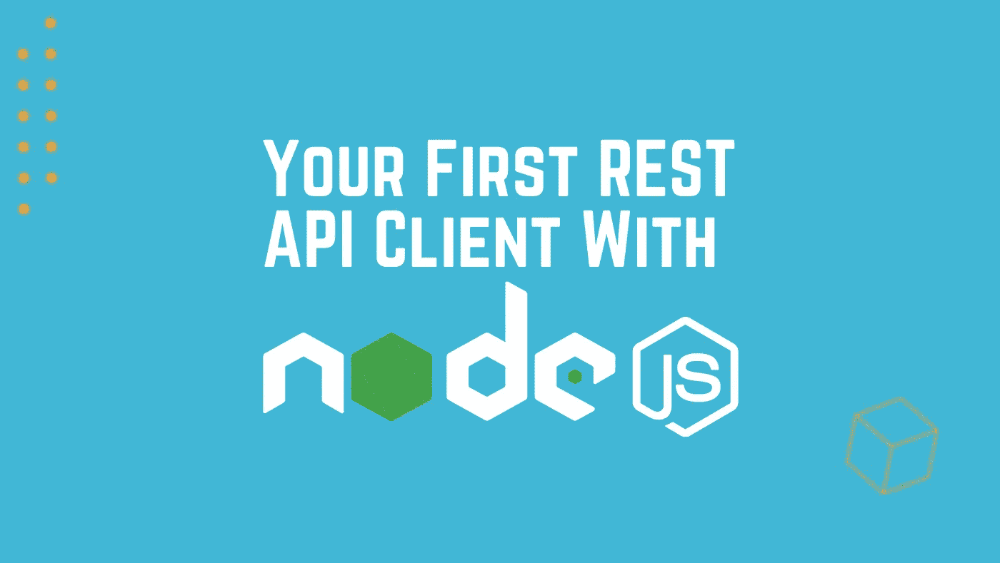

# 您的第一个 NodeJS REST API 客户端

> 原文：<https://medium.com/nerd-for-tech/your-first-nodejs-rest-api-client-59467659ab99?source=collection_archive---------1----------------------->



我们的教程中几乎涵盖了所有流行的 REST API 客户端，比如 [Python](https://marketdata.tradermade.com/docs/restful-api#python) 、 [PHP](https://marketdata.tradermade.com/docs/restful-api#php_curl) 、 [C#](https://marketdata.tradermade.com/docs/restful-api#c-sharp) 、 [Golang](https://marketdata.tradermade.com/docs/restful-api#golang) 。然而，我们错过了最明显和最受欢迎的 one - NodeJS。我们的目标是通过向您展示一个使用 Axios 的 NodeJS RESTful API 客户端的简单实现来弥补。本教程假设您对 Javascript 语法有非常基本的了解，并且有一些基本的编程经验。

在本教程中，您将学习以下内容:

1.  下载并安装 Nodejs。
2.  设置 NodeJS (node.js)环境
3.  设置一个免费帐户从 REST API 获取数据。
4.  从 API 中检索数据
5.  解析 JSON 数据并显示输出。

我们开始吧！

# 下载并安装节点

# Windows 和 Mac:

*   从 Nodejs.org 下载
*   运行安装并接受默认值

# Linux:

*   以 root 用户身份登录或以 sudo 用户身份运行

> apt-get 安装节点 js

# **设置 NodeJS (node.js)环境**

现在您已经安装了 NodeJS，通过键入以下命令检查您的安装:

> 节点 v

您应该看到:

> v14.18.1

为你的程序创建一个目录。

打开命令提示符或终端，获取运行我们的客户机所需的依赖项(库)。我们将使用“axios”库，因为它简化了 HTTP 请求，所以运行以下代码:

```
npm i axios
```

我们现在已经准备好了我们需要的环境。

# 建立一个帐户并获得一个 API 密钥

注册并[创建一个账户](https://marketdata.tradermade.com/signup)，你将会收到一封欢迎邮件。如果您已经在我们这里注册，请使用这个[仪表盘](https://marketdata.tradermade.com/myAccount)获取密钥。

# 编写 REST 客户端并通过 REST API 检索外汇和 CFD 数据

现在，您已经设置好了环境，导航到您创建的目录并创建一个文件，我将调用 mine TMSRESTClient.js。

好了，开始编码吧。

首先，我们将导入 Axios 库

```
const axios = require('axios');
```

然后，我们编写一个 get 命令并传入实时端点的 URL，您将需要在下面的代码中替换您的 API 键，并更新您希望调用的货币。对于这个例子，我们将调用几个外汇汇率和一个 CFD 汇率，因为它们返回的数据略有不同。

```
axios.get('https://marketdata.tradermade.com/api/v1/live?currency=EURUSD,GBPUSD,UK100&api_key=YOUR_API_KEY')
  .then(response => {
    console.log(response.data);
  })
  .catch(error => {
    console.log(error);
  });
```

要运行该程序，我们在文件所在的目录中打开一个命令提示符，并键入以下命令。

```
node TMSdataClient.js
```

您应该会得到类似如下的输出

```
{
  endpoint: 'live',
  quotes: [
    {
      ask: 1.16411,
      base_currency: 'EUR',
      bid: 1.1641,
      mid: 1.1641,
      quote_currency: 'USD'
    },
    {
      ask: 1.38079,
      base_currency: 'GBP',
      bid: 1.38078,
      mid: 1.38078,
      quote_currency: 'USD'
    },
    { ask: 7199.3, 
      bid: 7198.2, 
      instrument: 'UK100', 
      mid: 7198.75 
    }
    ],
    requested_time: 'Thu, 21 Oct 2021 08:42:21 GMT',
    timestamp: 1634805742
}
```

瞧啊。我们现在有了来自 REST API 的实时数据。然而，这是原始的 JSON，所以现在我们将做一些工作来遍历数据，并以更可读的格式输出它。

从上面的 JSON 可以看出，quotes 对象是一个包含键和值的映射数组。但是，CFD 映射只有一个工具关键字字段，而货币映射有 base_currency 和 quote_currency 关键字。因此，我们将添加一个 if 语句来检查 base_currency，并在 base_currency 不在地图上时解析该工具。然后，我们从每个报价中抽取出价和要求，并输出它。

```
for (quote in response.data.quotes){
        quoteData = response.data.quotes[quote];
        ccy = ""
        if ( quoteData["base_currency"] != undefined){
            ccy = quoteData["base_currency"] + quoteData["quote_currency"]          
        }else{
            ccy = quoteData["instrument"]
        }
        console.log(" Symbol " + ccy + " Bid " + quoteData["bid"] + " Ask " + quoteData["ask"])
}
```

如果您再次运行该程序，您应该会看到下面的解析输出。

```
Symbol EURUSD Bid 1.16416 Ask 1.16417
Symbol GBPUSD Bid 1.38078 Ask 1.38079
Symbol UK100 Bid 7199.4 Ask 7200.6
```

在本例中，我们使用了实时端点，但稍加修改的相同代码将适用于所有其他 TraderMade 端点、[历史汇率](https://marketdata.tradermade.com/docs/restful-api#historical_rates)、[分笔历史汇率](https://marketdata.tradermade.com/docs/restful-api#tick_historical)、[分钟历史汇率](https://marketdata.tradermade.com/docs/restful-api#minute_historical_rates)、[小时历史汇率](https://marketdata.tradermade.com/docs/restful-api#hour_historical_rates)和[时间序列](https://marketdata.tradermade.com/docs/restful-api#timeseries)。

请为我们的作品鼓掌并评论。我们对建议和想法持开放态度，我们一直期待着您的反馈。