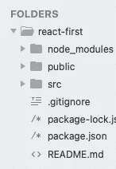
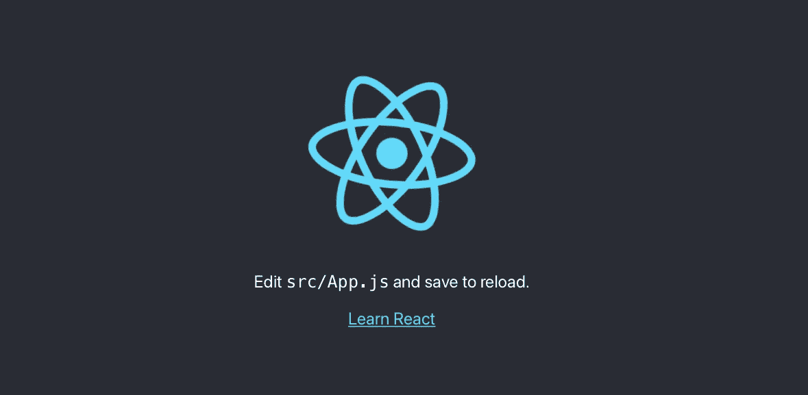
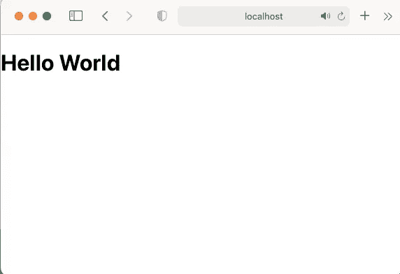
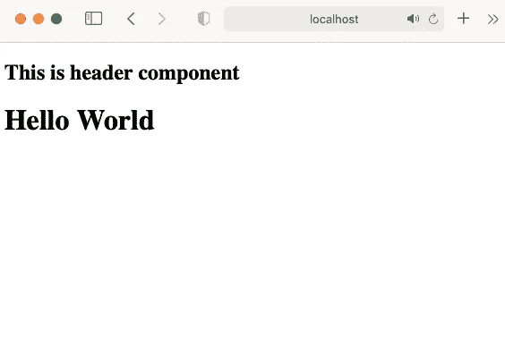
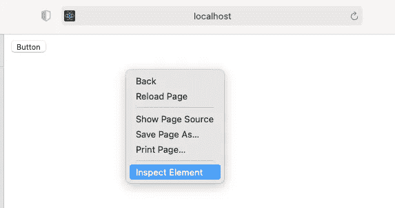
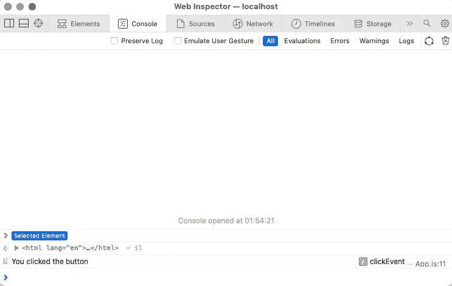
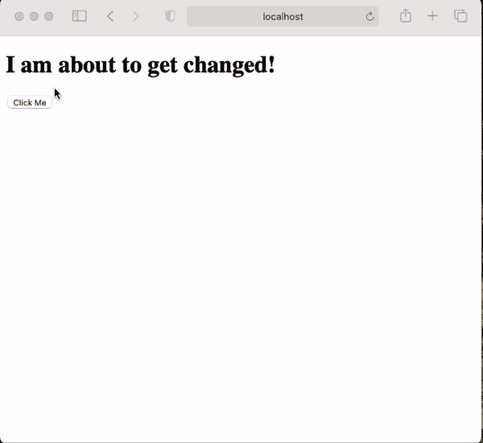

# React.js 适合初学者。基本的一步一步的例子和解释指南。

> 原文：<https://medium.com/nerd-for-tech/your-first-react-project-basic-step-by-step-guide-with-examples-and-explinations-d2ed69e6b3c8?source=collection_archive---------2----------------------->

照片由[劳塔罗·安德烈亚尼](https://unsplash.com/@lautaroandreani?utm_source=medium&utm_medium=referral)在 [Unsplash](https://unsplash.com?utm_source=medium&utm_medium=referral) 上拍摄

先决条件:IDE、节点、npm、React。([安装步骤](/nerd-for-tech/how-to-create-and-run-react-js-app-on-macos-a92115f9ee31))

需要 html，css，java 脚本和网络开发的基础知识。

## *索引*

1.  创建 React 应用

2.反应中的成分。

3.使用状态挂钩。

## 创建 React 应用程序。

首先，使用以下命令确保您已经安装了 Node、npm 和 react

> 节点 v

目前我使用的是最新版本的 node 16 . 13 . 1。

> npm -v

我使用的是 NPM 8 . 3 . 0 版本

检查后，你已经反应安装在电脑上。用您选择的名称创建一个文件夹。导航到该文件夹并运行以下命令

创建新文件夹。

> mkdir 新文件夹

使用以下命令导航到该文件夹。

> cd 新文件夹

使用以下命令创建 react 应用程序。

> npx 创建-反应-应用程序应用程序名称

appname 可以是你选择的任何东西。命令是 create-react-app，后跟您选择的应用程序名称。

安装 react 后，您可以看到在您的应用程序文件夹中创建的上述文件文件夹。

要运行 react 应用程序，请在终端中键入以下命令

> npm 开始

注意:在运行上述命令时，您必须位于 react app 文件夹中

在 [http://localhost:3000](http://localhost:3000) 的浏览器中运行该命令后，您可以看到以下网页正在运行

你做到了！

构建项目所需的所有模块都可以在 **node_modules 文件夹**中找到。

**公共文件夹**包含 index.html、fevicon.ico、manifest.json 等文件

**src 文件夹**包含文件 App.css、App.js、App.test.js、index.css、index.js、logo.svg、reportWebVitals.js 和 setupTests.js。

像在基本的 html css 网站中，我们使用 index.html 作为根网页。在 react 中，我们使用 App.js 来控制哪个网页将成为登录页面，在我们的代码中有 index.js。

现在从清理一些不必要的文件开始。删除名为 App.css、App.test.js、index.css、logo.svg、reportWebVitals.js 和 setupTests.js 的文件。

***例 1:先反应 App***

现在打开 **/src/App.js** ，修改代码使其成为 hello world。您可以在 **App.js** 中看到以下代码

按如下方式更改 App.js 代码

react 中 Hello world 的程序！

现在，在终端中键入 npm start 命令来运行 react 应用程序，如果该命令已经在运行，只需刷新页面。

你好，世界在反应！

现在你可以看到 Hello World 正在显示。

## React 中的组件

组件是 react 中最重要的概念之一。实际上，react 是一个包含多个组件的单页面应用程序(SPA)。例如，传统的 html css 网站，你必须一直在多个页面上写页眉和页脚，这是在你创建的每个页面上重复的相同代码。React 提供只需编写一次的组件，可以在网页上随时调用。

让我们在已经存在的 Hello world 页面中创建一个组件。按照以下步骤在网站中创建并调用 react 组件。在 src 中创建一个名为 components 的文件夹。

***例 2:部件在反应***

通过创建名为 Header.js 的文件编写以下代码。

现在更新 app.js 中的代码，如下所示

在代码中你可以看到我们正在使用***导入标题。/components/Header"*** 然后在网页上使用 ***< Header / >调用它。******”。/components/Header"*** 指定头文件出现的位置。

现在运行命令 *npm start* 来启动 react 应用程序，如果命令已经在运行，您可以刷新页面。您可以看到下面的输出。

React 组件输出！

## 在 React 中使用点击事件

反应过来的事件都写在[骆驼](https://en.wikipedia.org/wiki/Camel_case)案中。了解按钮和单击事件。

***例题 3:***

在 App.js 中编写以下代码

刷新 web 浏览器后，您将能够看到一个按钮。

现在右击网络浏览器并点击*检查元件。现在你可以看到一个这样的窗口。*

当您点击该按钮时，您可以在控制台中看到写在 *console.log 中的消息(“消息”)*。

## **使用状态挂钩**

在 React 16.8 中引入了钩子。状态挂钩允许您使用其他 React 特性，而无需编写额外的类。

react 中的 useState 钩子允许我们在开始时定义一些值，并且我们可以在执行一些操作后更新状态的值。

***例 4:***

让我们制作一个示例，将代码复制粘贴到 App.js 中

运行上述代码后，您可以看到如下输出。

您可以在这个 Github 资源库中找到所有代码。

 [## GitHub-AkshayDevkate/TODOWebApp

### 此时您不能执行该操作。您已使用另一个标签页或窗口登录。您已在另一个选项卡中注销，或者…

github.com](https://github.com/AkshayDevkate/TODOWebApp)