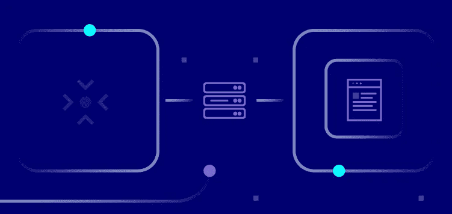

# 创建仓库优先数据分析堆栈的指南

> 原文：<https://medium.com/nerd-for-tech/your-guide-to-creating-a-warehouse-first-data-analytics-stack-d6fca21daca5?source=collection_archive---------2----------------------->

Mixpanel 的创始人 Suhail Doshi 曾经[说过](https://www.newyorker.com/magazine/2015/05/18/tomorrows-advance-man):“世界上大多数人会通过猜测或者凭直觉来做决定。他们要么幸运，要么错误。”组织要做出明智的商业决策，如决定追求什么新的商业机会或如何减少客户流失，他们需要数据。

但是，[根据 Gartner 的 2020 年分析调查](https://www.gartner.com/en/marketing/insights/articles/gartner-marketing-data-analytics-survey-2020-analytics-fail-expectations)，现实是，即使有数据，大多数公司仍然无法从他们的分析中获得有意义的商业见解。原因？很少有公司能够正确地组合来自营销、销售、产品和财务团队的不同数据源，并且很少将业务上下文应用于采样数据。然而，采用数据仓库优先的数据分析方法可以将您公司的所有数据集中在一个位置，使您能够完全控制和访问您的所有数据，从而克服这些问题。

# “仓库优先”数据分析到底是什么意思？

仓库优先的数据分析堆栈是一种具有单一数据存储库(也称为数据仓库)的分析堆栈，所有客户数据都输入到该存储库中。组织内使用的分析工具(如 Google Analytics)和其他客户工具(如 Salesforce)会产生数据孤岛，并且无法相互通信。这使得组织很难访问做出复杂决策所需的所有数据。

通过将您公司的所有数据收集到一个位置，您能够在大型、多样化、高质量的数据集上构建高效的分析，以回答您的分析工具本身无法回答的问题。

例如，假设你的公司是一家初创公司。在这种情况下，你可能只是想了解客户如何看待你的产品或与你的产品互动，所以你可能会有这样的问题:

*   这个月我们有多少活跃用户？
*   我们的总保留率是多少？
*   我们推荐注册的主要来源是什么？

在这种情况下，只使用像谷歌分析(Google Analytics)、Mixpanel 或 Amplitude 这样的工具就可以了。但是随着公司的发展，您将需要更复杂问题的答案，例如:

*   用户第一天的什么行为表明他们可能会注册付费计划？
*   什么样的模式或条件会导致我们产品购买量或使用量的增加或减少？
*   我们应该向特定用户交叉销售或推荐什么产品来增加收入？
*   我们应该如何根据购买成本或每个客户的资源成本来为我们的产品定价？

上面提到的分析工具本身无法回答这些问题，因为它们无法访问所有需要的数据。例如，在零售环境中，假设您想要预测单个客户可能会购买什么产品，以便您可以提供量身定制的建议。您需要考虑来自不同来源的各种数据，例如:

*   您的分析工具跟踪的用户事件数据
*   交易或支付历史记录，可能存储在条带或内部系统中
*   先前营销活动的参与度，可能存储在 Marketo 或脸书广告管理器中
*   可能存储在 Salesforce 或 Zendesk 等 CRM 工具以及您组织内使用的其他客户工具中的以前投诉或与您组织的沟通

但是，因为所有这些不同类型的数据都被孤立在您的分析工具无法访问的各个平台中，所以这变成了一项困难或不可能的任务。

在之前的一篇文章中，我们讨论了采用数据仓库优先的分析方法的好处。在本文中，我们将讨论可以考虑的不同工具，以构建一个优化的仓库优先的数据分析堆栈，该堆栈允许产生有价值的分析。

# 仓库优先数据分析堆栈的要素

仓库优先的数据分析堆栈由几个关键元素组成。您将需要几类工具来促进数据的收集、存储和移动，以便于您进行分析。

对于每个元素，让我们来看看一些适合完成工作的工具。

# 所有数据的去处:数据仓库

将您公司的所有数据放在一个地方，不仅可以让您完全掌控所有数据，还可以进行更深入的分析。这也意味着您可以随时轻松地转移到不同的分析工具，因为您可以导入您的历史数据。

有许多数据仓库可供选择，红移、雪花和 BigQuery 是最受欢迎的。但是，在选择数据仓库之前，您需要考虑以下因素:

**您将存储什么类型的数据:**是结构化数据(适合行和列的数据)还是半结构化数据(如电子邮件、社交媒体帖子或地理数据)？

**您计划在数据仓库中存储的数据量:**对于大多数用例来说，没有必要担心这一点，因为任何数据仓库通常都能够存储大量数据，而无需额外的成本。

**数据仓库扩展的难易程度:**是否有足够的存储和计算资源在需求或旺季处理数据而不影响性能？

**管理要求:**您是否愿意投入工程时间来清理、调整和监控集群，以确保保持强大的性能？对于较小的团队来说，拥有一个全面管理、自我优化的数据仓库是有意义的，这样您的工程师就可以专注于构建您的产品。然而，手动管理仓库意味着您拥有更大的灵活性和控制力，可以根据您公司的需求对其进行精确优化。

**花费多少:**数据仓库的定价结构是基于存储容量、运行时间和查询的组合。如果您经常对数据执行查询，您应该选择计算成本更低的解决方案。

## 红移

[Redshift](https://aws.amazon.com/redshift/) 是亚马逊网络服务(AWS)旗下的数据仓库。Redshift 是一个关系数据仓库，因此只接受结构化数据类型。红移需要某种管理，在高需求时期，如果您需要扩展，那么您需要通过添加新节点来手动处理。根据集群中节点的类型和数量，使用[至少需要 0.25 美元](https://aws.amazon.com/redshift/pricing/)。总的来说，对于已经投资 AWS 工具和部署来与其他 AWS 产品无缝集成的组织来说，Redshift 可能是一个理想的选择。

## 雪花

[雪花数据仓库](https://www.snowflake.com/workloads/data-warehouse-modernization/)具有列数据库引擎功能，这意味着它可以处理结构化和半结构化数据，比如 JSON 和 XML。它会根据需求自动扩展或缩减，并通过自动化管理和维护进行全面管理。此外，它有一个解耦的架构，允许计算和存储分别扩展，数据存储由用户选择的云提供商(Google Cloud、AWS 或 Azure)提供。[雪花的定价](https://www.snowflake.com/pricing/)基于你存储在雪花中的数据量和你使用的计算时间。因此，您可以在不使用计算资源时将其关闭。如果你已经在使用上述三种云存储中的任何一种，并且不想转换，那么雪花可能是你的理想选择。

## BigQuery

[BigQuery](https://cloud.google.com/bigquery) 是 Google Cloud 打造的无服务器、高可伸缩、高性价比的多云数据仓库。它基于 Google 内部基于列的数据处理技术“Dremel”，因此能够处理结构化和半结构化数据。它还是一个完全托管的数据仓库，可以根据您的需要自动分配计算和存储资源。

BigQuery 有[两种定价模式](https://cloud.google.com/bigquery/pricing):按每次查询处理的字节数付费，或者通过购买特定时间段的专用虚拟 CPU 来支付固定费用。BigQuery 的一个关键区别在于它与 BigQuery ML 的集成。因此，如果你希望在数据仓库的基础上建立机器学习模型来帮助预测，这可能是使用 BigQuery 的一个好理由。

# 传输数据的工具:数据管道

一旦您完成了保护数据仓库的工作，数据管道就是下一个要考虑的事情。简单地说，数据管道可以被认为是数据传输器。它从源获取数据，对数据执行一些数据处理操作，然后将数据传输到目的地。

在仓库优先的数据分析设置中，需要三种类型的数据移动:

*   将用户事件流从应用程序或网站移动到仓库和其他需要它的分析或客户工具。
*   将 Zendesk 或 Salesforce 等客户工具中的非用户事件转移到仓库中。
*   将数据模型从仓库移动到不同的客户工具中，以便激活分析。

***第一种运动叫做事件流*** 。为了客观地看待问题，让我们假设您组织中的营销和产品团队想要跟踪您的网站或移动应用程序上的用户注册事件。营销团队希望谷歌分析中的这些数据能够跟踪广告支出和其他活动的转化率。与此同时，产品团队希望振幅数据能够跟踪用户旅程和用户流量。

通常，来自这两个工具的 SDK 将被添加到网站或应用程序源代码中，以跟踪此事件。这将需要两个单独的 HTTP 调用和网络调用，这将增加额外的性能开销。想象一下如果有五个这样的工具会有多大的开销！相反，使用事件流数据管道工具，您可以仅使用一个 SDK 来检测您的网站和应用程序。事件流工具将使用事件，将其转换为两个工具可以接受的不同格式，并将其发送给它们和数据仓库。不再需要处理 API 变更和管道中断。

当团队想要切换工具并向堆栈中添加新工具时，这种方法也很有帮助。你不需要修改代码库来删除或添加任何新的 SDK。相反，您可以通过事件流工具的仪表板简单地删除该工具或集成新工具。一些公司使用 Apache Kafka 或 Amazon Kinesis 等工具构建内部解决方案，但大多数公司选择易于实施和管理的系统，如 [Segment](https://segment.com/) 和 [RudderStack](https://rudderstack.com/) 。

***第二种类型的数据移动是将非用户事件*** 存储在不同云客户工具中的数据，如脸书广告管理器或 Marketo，移动到您的仓库中。这一点很重要，因为从您的数字产品(网站或应用程序)中捕获的事件数据只是客户数据的一个子集，并不能单独提供客户身份的详细、统一的视图。

这类工具被称为 ELT 工具。ELT 代表“提取、加载、转换”，这是从 Salesforce 或 QuickBooks 等系统获取数据并将其插入数据仓库所需的步骤。此类工具有 [Fivetran](https://fivetran.com/) 和 [Stitch](https://www.stitchdata.com/) 。

***第三种类型的移动是从数据仓库到其他云工具*** 。将数据仓库中的数据建模成数据模型(下一节将详细介绍)后，如何将数据模型从数据仓库中取出并放入不同的分析激活工具中，如 Marketo、Kissmetrics 或 Optimizely？这个过程被称为逆向英语教学。这类工具的例子有[人口普查](https://www.getcensus.com/)和[高度接触](https://www.hightouch.io/)

随着现代公司转向仓库优先的架构，许多公司发现为这三个独立的管道管理多个供应商既痛苦又复杂。进入方向舵堆栈。

[RudderStack](https://rudderstack.com/) 可以认为是 Segment + Fivetran + Hightouch 的开源组合。这是一个一体化的客户数据管道。它可以从您的数字产品中捕获事件数据，并通过其[事件流](https://rudderstack.com/product/event-stream)功能将其发送到您的数据仓库和其他工具。它使用[云提取](https://rudderstack.com/product/cloud-extract)特性来聚合和关联数据仓库中的非事件数据和事件数据。最后，为了从数据仓库中获取数据，它有一个反向 ELT 特性，称为[仓库操作](https://rudderstack.com/product/warehouse-actions)。还有，它的源代码在 [GitHub](https://github.com/rudderlabs) 上是公开的，所以你可以选择自托管或者付费使用 RudderStack Cloud(但是你可以免费上手)。

# 为分析准备数据:数据建模工具

当数据管道完成了将来自不同来源和事件的客户数据拉入数据仓库的工作后，下一步是理解所有这些数据。

数据建模就是组织、转换和分组数据，以满足特定的目的。例如，假设您需要生成一份公司内最高终身价值客户的报告。您需要将分散在数据仓库中的所有必需数据组织到一个数据集中，从这个数据集中可以生成报告。

一旦数据被建模，从中提取价值就容易得多，无论是以仪表板或报告的形式，还是作为预测或说明性分析的基础。

在选择数据建模工具时，重要的是选择一个允许您在数据仓库中对数据建模的工具，而不是将其导出到不同的工具。

## dbt

最流行的数据建模工具之一是由 [dbtlabs](https://www.getdbt.com/dbt-labs/about-us/) 构建的 [dbt](https://www.getdbt.com/) 。dbt(数据构建工具)使数据分析工程师能够通过简单地编写 SQL select 语句来转换他们仓库中的数据。dbt 获取这些 SQL 代码，并针对您的数据仓库运行它们，以创建表和视图。

dbt 使数据工程师能够像软件工程师一样工作，进行版本控制、持续集成和内置测试。因为 dbt 是基于 SQL 的，所以很容易上手。另外，dbt 是开源的，在 Slack 上有一个非常活跃的社区。

## LookML

数据建模类别中的另一个工具是 [LookML](https://docs.looker.com/data-modeling/learning-lookml/what-is-lookml) 。Google Cloud 将 LookML 作为建模层/组件嵌入到 [Looker](https://looker.com/) 商业智能/可视化工具中。LookML 融入了一些简洁的数据类型，这些数据类型不一定融入 SQL 或您的数据库。但是，要使用 LookML，您需要将数据从仓库转移到 Looker 中。这意味着您创建的数据模型将被锁定在 Looker 中，您无法将其发送到其他工具。

例如，在 RudderStack，我们使用 dbt 来建模和创建数据集。然后，数据集以表格的形式存储在仓库中，可以随时发送到 Looker 或 Salesforce 或 Mixpanel 等其他平台。

# 利用数据:可视化工具

没有可视化，数据建模是不完整的。现在，您已经将仓库中的数据转换为丰富的数据集，下一步是将其输入可视化工具，该工具将允许您以图表、地图、图形或图像的形式直观地表示这些数据集，以便从中获得有价值的见解。

市场上有很多可视化工具。一些流行的是 Tableau、FusionCharts 和 Metabase。然而，在您选择工具之前，您应该考虑诸如易用性、学习曲线、对您选择的数据仓库的支持、灵活性级别、定制选项以及它是否适合您的用例。

## （舞台上由人扮的）静态画面

[Tableau](https://www.tableau.com/) 通常被认为是无可争议的数据可视化软件之王，这是有道理的。因为它的易用性和生成交互式视觉效果的能力远远超过标准 BI 解决方案。它特别适合处理大型且快速变化的数据集。

## 元数据库

[Metabase](https://www.metabase.com/) 是一个开源的商业智能工具，它允许您使用来自数据仓库的数据集创建图表和仪表板。虽然生成可视化并不需要 SQL，但是元数据库允许 SQL 进行复杂的定制。它的简单性和易用性是许多用户喜欢它的主要原因。

## FusionCharts

FusionCharts 是一个流行的基于 JavaScript 的可视化工具。有助于 FusionCharts 流行的一个功能是，不用从头开始每个新的可视化，您可以通过简单地放入您的数据集来使用各种“实时”示例模板。

# 扩展堆栈:仓库机器学习工具

您的分析不必止于建模和可视化。仓库优先的数据分析堆栈的美妙之处在于，对于仓库中的所有海量数据，您都有构建机器学习模型所需的数据。您可以更进一步，以预测或说明性模型的形式为推荐引擎、流失预测或服务器负载的预测性维护等生成推论。

这在一些我们喜欢称之为“仓库机器学习工具”的工具的帮助下是可能的这类工具的例子有 BigQuery ML 和 Continual。如果您已经使用 BigQuery 作为数据仓库的选择，那么您可以使用 BigQuery ML。否则，请继续查看。

## 大查询 ML

BigQuery ML 是谷歌数据仓库产品 BigQuery 的一个组件。它允许您使用标准 SQL 查询在 BigQuery 中创建和执行机器学习模型。BigQuery ML 使数据分析师能够通过现有的 SQL 工具和技能使用机器学习。

## 频繁的

[continuous](https://continual.ai/)给自己贴上了“现代数据堆栈中缺失的人工智能层”的标签它提供了一个简单的工作流程来构建预测模型，可以在数据仓库的基础上预测从客户 LTV 和客户流失到库存预测和设备故障的任何事情。它还可以很好地与 dbt 集成，并可以直接从您的 dbt 工作流中使用数据集。

# 首先向仓库转移

使用仓库优先的数据分析堆栈并不意味着您要放弃基本的分析工具。它们对于基本分析仍然很方便。然而，仓库优先的方法为您提供了执行更深入分析和回答分析工具无法回答的问题的武器库。

如果你的公司刚刚起步，像 Google Analytics 或 Amplitude 这样的分析工具可以满足你需要答案的问题。但是从长远来看，你会超越它们，你越早建立你的数据仓库越好。

*本博客最初发表于:* [*https://rudder stack . com/blog/your-guide-to-creating-a-warehouse-first-data-analytics-stack*](https://rudderstack.com/blog/your-guide-to-creating-a-warehouse-first-data-analytics-stack)