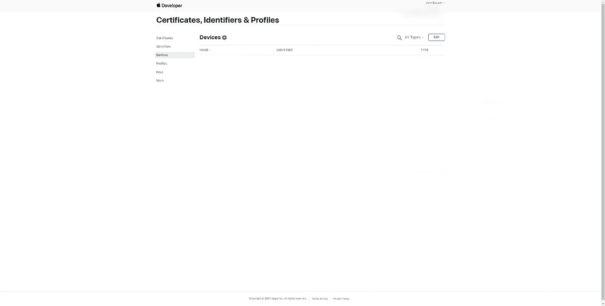
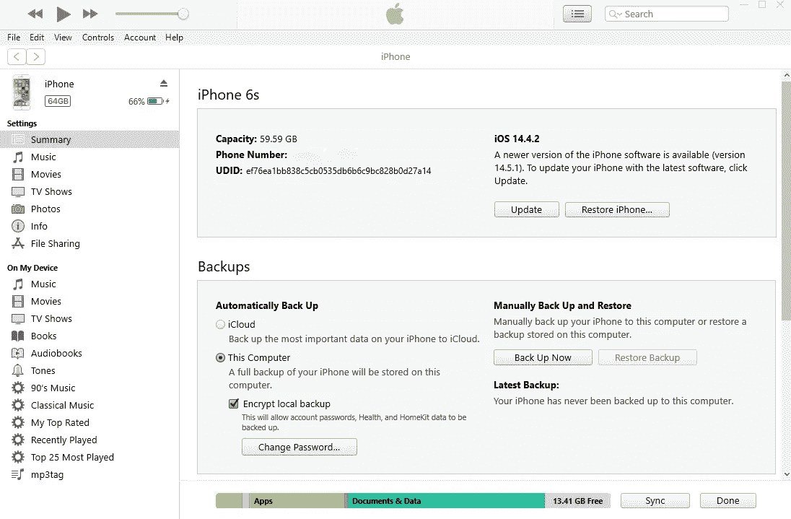
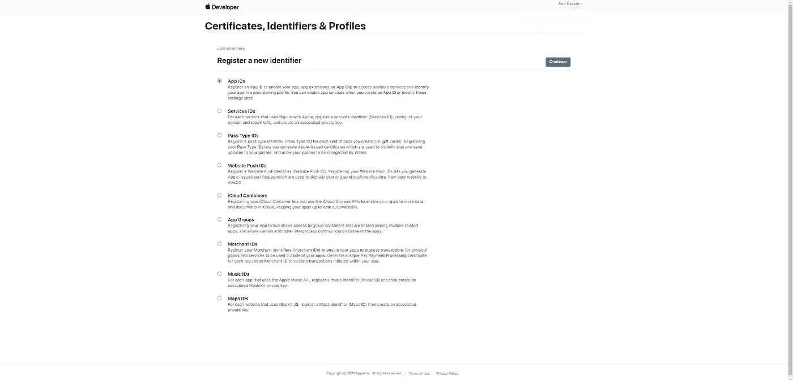
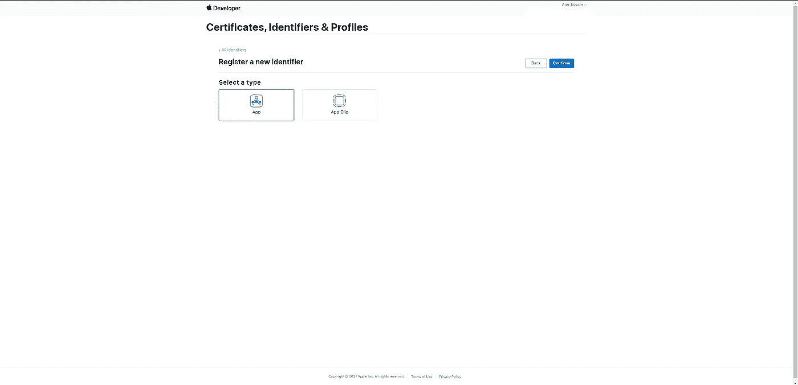
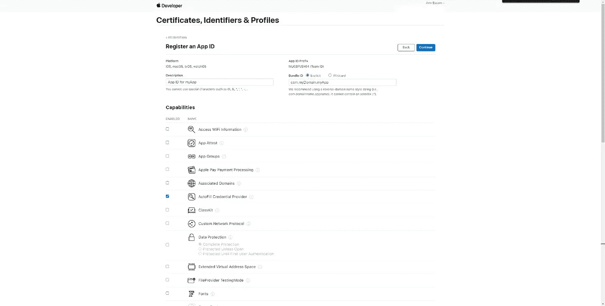
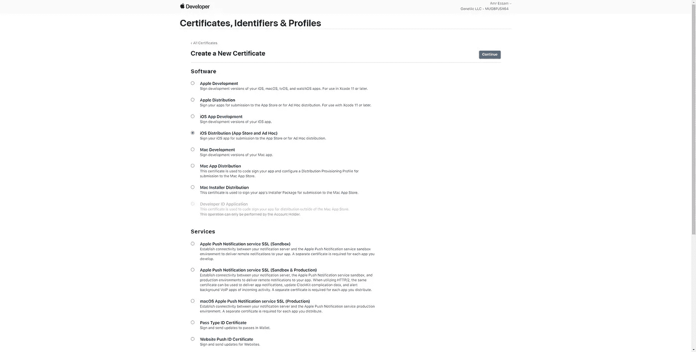
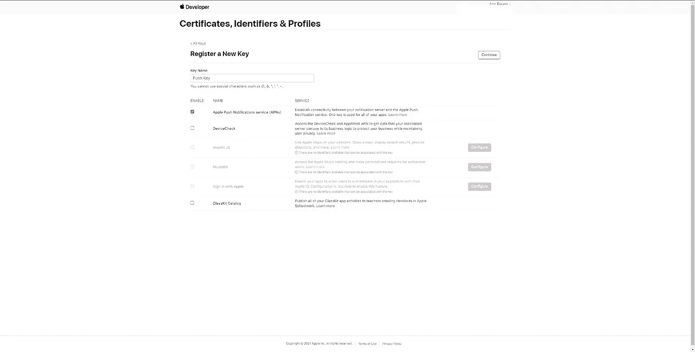
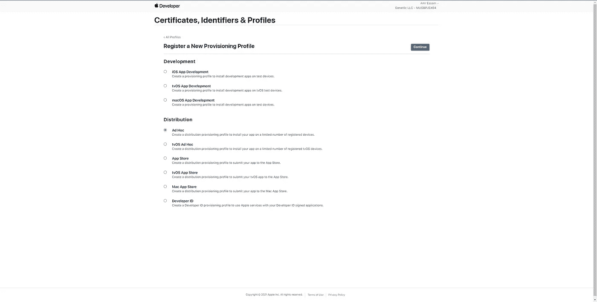
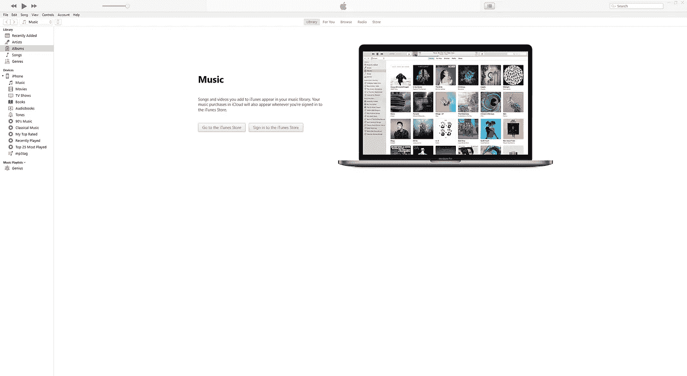

# 如何在不使用 Xcode 或 macOS 的情况下在 iOS 上安装 Expo React 原生应用程序

> 原文：<https://medium.com/nerd-for-tech/your-guide-to-testing-your-expo-react-native-application-on-ios-abbde4086d08?source=collection_archive---------2----------------------->

有没有想过如何在 iOS 上安装或部署 Expo react 本地应用程序，而无需使用 Xcode 或 macOS？如果你只是想知道或者尝试过，但是没有找到方法，猜猜会发生什么？这个教程是给你的。

在本文中，我们将一步一步地介绍，直到您在 iOS 设备上打开 Expo 管理的工作流应用程序。ipa”文件。

如前所述，这篇文章最适合使用 Expo 管理工作流的用户，有关管理工作流和裸工作流之间差异的更多信息，您可以参考这篇 Expo [文章](https://docs.expo.io/introduction/managed-vs-bare/)。

这些步骤是在 Ubuntu 上执行的，但是如果你使用的是另一个 Linux 发行版，甚至是 Windows，这些步骤也不会改变。

我们将经历 11 个步骤:

*   在前 8 个步骤中，我们会配置您的 Apple 开发人员帐户，并创建构建您的应用程序所需的文件。
*   在第 9 步中，我们修改您的 Expo 项目文件。
*   在第 10 步中，我们使用 Expo 命令构建您的应用程序。
*   在步骤 11 中，我们在 iOS 设备上安装您的应用程序。

# 第一步，创建一个苹果开发者账户

我不会在本教程中介绍这一步，但你可以很容易地找到很多关于如何做到这一点的教程，或者只是使用[官方](https://developer.apple.com/support/app-account/)的一个，不幸的是，你不能跳过这一步，没有苹果开发者帐户，没有其他方法可以在你的 ios 设备上下载你的应用程序。

# 第二步，注册你的测试设备

作为 Apple 防止开发者在未经验证的商店分发其应用程序的安全措施的一部分，Apple 要求您注册您计划用于测试的设备。
在这一步，我们将注册测试所需的设备。

在您的开发者帐户中，导航至“设备”[选项卡](https://developer.apple.com/account/resources/devices/)。



Apple 开发者帐户上的“设备”标签

1-导航到设备[选项卡](https://developer.apple.com/account/resources/devices/list)后，单击“+”图标添加新设备。

2-如果您打算在 iOS 设备上测试您的应用程序，请选择您的平台，即“iOS、tvOS、watchOS”。

3-写下您的设备名称，您可以通过进入“设置”>“通用”>“关于”在您的 iOS 设备上轻松找到它。

4-最后你会被要求的是 UDID，它代表“唯一的设备标识符”，最简单直接的方法是将你的 iOS 设备连接到你的 iTunes，然后点击“音乐”旁边的设备图标，然后点击“序列号”，你会发现“序列号”标签切换到“UDID”，旁边的文字是你的“UDID”。



iTunes 中的 UDID

5-最后点击继续，你已经成功地完成了第 2 步。

在我们离开这一步之前，您可以通过上传包含您刚刚手动添加的信息的文件来注册多个设备，您可以在单击“+”按钮后找到 Apple 提供的样本文件。

# 步骤 3，创建一个标识符

在这一步中，我们将为您的应用程序创建一个唯一的标识符，因此您需要做的第一件事就是导航到“标识符”[选项卡](https://developer.apple.com/account/resources/identifiers/list)。

1-导航到“标识符”[选项卡](https://developer.apple.com/account/resources/identifiers/list)后，点击“+”图标添加新的标识符。

2-选择“应用程序 id ”,然后单击继续。



苹果开发者账户上的标识符注册页面

3-选择应用程序并点击“继续”。



Apple 开发者帐户上的标识符类型页面

4-为您的应用程序标识符编写描述，例如，如果您的应用程序名称为“myApp”，您可以使用“myApp 的应用程序 ID”。

5-写下你的 bundle ID，你会发现苹果推荐使用反向域名样式字符串，比如你的域名是“myDomain.com”，你的应用名是“myApp”，那么推荐名是“com.myDomain.myApp”。



Apple 开发者帐户上的标识符功能页面

6-选择应用程序所需的功能，例如，您可以选择“自动填充凭据提供程序”和“推送通知”。

# 步骤 4，创建 CSR(证书签名请求)

在这一步中，我们将生成一个 CSR，该 CSR 将在步骤 5 中用于在 Apple developer 帐户中创建证书。

因此，在我们创建 CSR 之前，CSR 是从证书颁发机构(Apple)请求证书的过程，以便 Apple 可以验证是谁在请求发行开发者证书的详细信息。想了解更多这个话题，可以参考[这篇](https://dzone.com/articles/ios-code-signing-part-2-certificate-signing-reques#:~:text=The%20Certificate%20Signing%20Request%20(CSR)%20is%20the%20process%20of%20requesting,from%20a%20local%20macOS%20machine.)文章。

1-打开终端，编写以下命令来生成密钥:

```
openssl genrsa -out mykey.key 2048
```

2-生成密钥后，我们将使用它来生成证书，所以假设我的电子邮件是“amr.essam95@hotmail.com ”,我的名字是“amr ”,我住在埃及，那么命令将是:

```
openssl req -new -sha256 -key mykey.key -out ios_distribution.csr -subj "/emailAddress=amr.essam95@hotmail.com, CN=Amr Essam, C=EG"
```

您需要在生成“mykey.key”文件的同一个目录中运行这个命令，因为正如您所看到的，我们在第二个命令中使用了它。

运行该命令后，会生成一个新文件“ios_distribution.csr”。

# 步骤 5，创建证书

在这一步中，我们将为您(开发人员)创建一个分发证书，因此该证书可以用于您的所有应用程序，有关证书的更多详细信息，您可以参考[这篇关于应用程序签名的](https://docs.expo.io/distribution/app-signing/) Expo 文章，这是一篇非常好的文章。

1-导航到“证书”[选项卡](https://developer.apple.com/account/resources/certificates/list)后，单击“+”图标添加新证书。

2-在“软件”部分，选择“iOS 分发(App Store 和 Ad Hoc)”，这将允许您在 iOS 设备上测试您的应用程序，如果您的使用模式不需要，您可以跳过“服务”部分。



Apple 开发者帐户上的新证书页面

3-单击“继续”后，将要求您上传我们在上一步中刚刚生成的 CSR 文件。

4-单击“继续”后，您现在已经成功生成了一个证书，您需要下载此证书，因为我们将在下一步中使用它。

# 步骤 6，创建推送通知密钥

在这一步中，我们将为推送通知创建一个键，它将在下一步中使用。

1-导航到“Keys”[选项卡](https://developer.apple.com/account/resources/authkeys/list)后，点击“+”图标添加一个新键。

2-写下按键名称，可以是任何名称，例如，您可以将其命名为“按键”。

3-选择“苹果推送通知服务(APNs)”并点按“继续”。



Apple 开发者帐户上的推送通知注册页面

4-下载您生成的密钥并保存它，因为它将用于构建您的应用程序(步骤 10)。

# 步骤 7，创建预配配置文件

在这一步中，我们将创建一个特定于应用程序的预置描述文件，您提交到 App Store 的每个应用程序都将有一个预置描述文件。预置描述文件将在 12 个月后过期，但这不会影响生产中的应用程序。下次构建应用程序时，您只需创建一个新的即可。

1-导航到“Profiles”[选项卡](https://developer.apple.com/account/resources/profiles/list)后，单击“+”图标添加新的配置文件。

2-选择“临时”,因为我们计划在 iOS 设备上分发此应用程序，然后单击“继续”。



Apple 开发者帐户上的预置描述文件注册页面

3-您将被要求输入我们在步骤 3 中创建的标识符，选择我们之前创建的标识符，然后单击“继续”。

4-将要求您提供与配置文件相关的证书，选择我们在步骤 5 中创建的证书，然后单击“继续”。

5-系统会询问您希望包含的设备，选择我们在步骤 2 中创建的设备。

6-最后你会被要求为这个概要文件取一个名字，你可以选择任何你想要的名字，例如，你可以使用“发布测试概要文件”。

7-单击“继续”并下载您的个人资料，因为我们稍后会用到它。

# 步骤 8，创建一个 p12 签名的证书

在这一步中，我们将创建一个“. p12”文件，该文件用于保存私钥。

1-导航到您保存在第 6 步中下载的“ios_distribution.cer”文件和在第 4 步中生成的密钥“mykey.key”的目录。

2-运行以下两个命令，第二个命令将要求您输入密码，因此请确保您记住它，因为我们将在接下来的一个步骤中使用它。在第二个命令中，我们将生成“ios_distribution.p12”文件。

```
openssl x509 -inform DER -outform PEM -in ios_distribution.cer -out ios_distribution.pemopenssl pkcs12 -inkey mykey.key -in ios_distribution.pem -export -out ios_distribution.p12 -name "Amr Essam"
```

# 步骤 9，修改你的 app.json 文件

开始生成您的”前的最后一步。ipa”文件正在用我们之前在第 3 步中创建的“bundle ID”修改您的“app.json”文件。

1-打开您的 app.json 文件，您应该会在“expo”对象中找到一个“ios”对象，就像这样，“ios”前面和后面的“…”指的是我们在这一步不涉及的内容。

```
{
 "expo": {
 ...
   "ios": {
     "supportsTablet": true,
     "icon": "./assets/icon.png",
     "bundleIdentifier": "com.myDomain.myApp"
   },
 ...
 }
}
```

2-写出我们在第三步中使用的包 ID，在我的例子中是“com.myDomain.myApp”。

恭喜您，我们已经完成了开始生成之前所需的所有步骤。ipa”文件，我们将下载到我们的 iOS 应用程序来测试我们的应用程序。

# 第十步，生成一个”。ipa”文件

在这一步中，我们将使用 Expo build 命令来生成一个。ipa”文件。

1-打开您的终端并导航到您的 Expo 项目，然后运行以下命令:

```
expo build:ios
```

2-您将被要求选择构建类型，我们将选择“存档”，这是一个适合下载您的”。ipa”文件，而不是模拟器。

3-系统会询问你是否有苹果开发者账户的访问权限，我们会写“y”表示有。

4-您将被要求输入您的苹果开发者帐户的电子邮件和密码。

5-提交您的电子邮件和密码后，系统会询问您是否提供您自己的“Apple 分发证书”，我们将选择“我想上传我自己的文件”。

6-您将被要求输入“P12”文件路径，我们将写入我们在第 8 步中生成的“P12”文件的路径，然后您将被要求输入我们在第 8 步中选择的密码。

7-输入您的密码后，您将看到一些命令加载，如“从 Apple 获取分发证书…”然后您将被要求输入“Apple 推送通知服务密钥”，我们将选择“我要上传我自己的文件”，然后写入我们在第 6 步中下载的文件的路径，该文件的扩展名为“p8”。

8-在输入“p8”文件的路径后，您将被要求输入“密钥 ID”，您可以通过进入 Apple 开发者帐户中的“密钥”[选项卡](https://developer.apple.com/account/resources/authkeys/list)来获取您的密钥 ID，然后单击我们在第 6 步中创建的密钥，我们将找到“密钥 ID”，然后我们将输入我们的“密钥 ID”。

9-输入您的“密钥 ID”后，将要求您输入“Apple 预置描述文件”，这是我们的最后一步，我们将选择“我要上传我自己的”，然后我们将为在第 7 步中下载的带有扩展名的预置描述文件写入路径。移动供应”。

10-输入路径后为您的"。mobileprovision”文件，您将发现您现在正在构建您的 Javascript 包，然后您的应用程序将在 Expo 服务器上构建，您将找到一个链接来跟踪您的应用程序构建。

11-打开监控构建的链接，等待构建完成，然后下载您的”。ipa”文件。

# 步骤 11，在你的 iOS 设备上安装你的应用程序，不要使用 Xcode 或者 macOS

最后，我们到达了最后一步，在我们的 iOS 设备上安装我们的应用程序。

1-打开 iTunes 并连接您的 iOS 设备，然后点击“帐户”选项卡下的“设备”图标。



苹果公司开发的热门软件（苹果公司开发的与 iPod 搭配的在电脑上使用的音乐播放器和音乐管理器）

2-点击“设备”图标后，您的设备将打开，拖动您的”。ipa”文件，直到它变成蓝色，然后离开鼠标。完成后，你会发现 iTunes 正在你的设备上下载应用程序。

iTunes 完成下载后，恭喜你，你会发现该应用程序现在已经在你的 iOS 设备上了，你可以像从 App Store 下载的任何其他应用程序一样打开它。

# 最终注释

*   如果您打算在第一次构建后再次构建您的应用程序，好消息是，您会发现所有的证书、密钥和预置描述文件都已保存，并且您不会再经历这些步骤，但是如果您想重新开始并清除所有保存的文件，您可以使用以下命令运行构建命令，而不是“expo build:ios”命令。

```
expo build:ios --clear-dist-cert --clear-push-key --clear-provisioning-profile
```

*   如果你还没有配置你的应用程序图标，你可以阅读[这篇](https://docs.expo.io/guides/app-icons/)教程，学习如何使用 Expo 轻松配置你的应用程序图标。

最后，如果你对这些步骤有任何问题，请随时通过我的 LinkedIn [账户](https://www.linkedin.com/in/amr-essam-15b228128/)联系我。

# 参考

[1] DZone，iOS 代码签名:第 2 部分，证书签名请求，[https://DZone . com/articles/iOS-Code-Signing-Part-2-Certificate-Signing-reques #:~:text = The % 20 Certificate % 20 Signing % 20 request % 20(CSR)% 20 is % 20 The % 20 process % 20 of % 20 正在请求，来自%20a%20local%20macOS%20machine。](https://dzone.com/articles/ios-code-signing-part-2-certificate-signing-reques#:~:text=The%20Certificate%20Signing%20Request%20(CSR)%20is%20the%20process%20of%20requesting,from%20a%20local%20macOS%20machine.)

[2] A.Hoefling，如何在没有 Mac 的情况下开发 iOS，[https://www . andrewhoefling . com/Blog/Post/How-To-Develop-iOS-Without-A-Mac](https://www.andrewhoefling.com/Blog/Post/how-to-develop-ios-without-a-mac)

[3]世博会，App 签约，【https://docs.expo.io/distribution/app-signing/ 