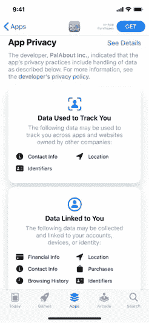
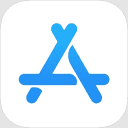
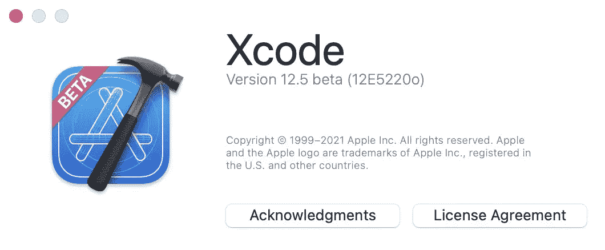
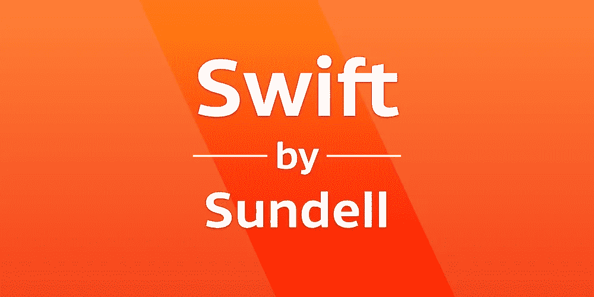

# Xcode 周刊-你一周的 iOS 开发剂量- 01

> 原文：<https://medium.com/nerd-for-tech/your-ios-dose-for-the-week-01-d1a947829805?source=collection_archive---------4----------------------->

## iOS 开发者周刊杂志

> 在一个 iOS 开发者的一生中，学习不是短跑，而是马拉松。但是我知道跟踪所有的博客、YouTube 频道、twitter 账户、会议、时事通讯等有多难。
> 
> Xcode Weekly 是我在一周内浏览的一系列 iOS 应用开发者的资料，我觉得这些资料很有意义。我正在和这里的每个人分享。
> 
> 有许多涵盖许多领域的每周时事通讯。但它们部分满足了我的需求。所以这是给那些可能寻找我寻找的东西的人的。
> 
> 所以让我们开始吧。

# 📰新闻

**1)**[***apptracking transparency 需求更新***](https://developer.apple.com/news/?id=8rm6injj)

去年年底，为了给你更多的准备时间，苹果公司暂时推迟了在请求追踪用户和访问设备广告标识符时使用 AppTrackingTransparency 的要求。这一要求现在从即将到来的测试版更新开始生效，并将在初春随着即将发布的 iOS 14、iPadOS 14 和 tvOS 14 向所有人推出。

*功劳-*[*developer.apple.com*](https://developer.apple.com)

[***App Store 审核指南更新现已推出***](https://developer.apple.com/news/?id=3ozbk628)

App Store 是客户发现和下载应用程序的安全可信的地方，也是开发者的绝佳机会。App Store 审核指南的更改和说明支持即将发布的操作系统中的新功能，更好地保护客户，并帮助您的应用尽可能顺利地通过审核流程。

*功劳【developer.apple.com】[-](https://developer.apple.com)*

*[***即将到来的应用和应用内购买的税费和价格变化***](https://developer.apple.com/news/?id=jzu72myl)*

*当税收或外汇汇率发生变化时，我们有时需要更新某些地区的 App Store 价格和/或调整您的收入。在接下来的几天里，您的收益将在以下地区进行调整，并将根据不含税价格进行计算。*

**

**功劳-*[*developer.apple.com*](https://developer.apple.com)*

*[***苹果推送通知服务服务器证书更新***](https://developer.apple.com/news/?id=7gx0a2lp)*

*2021 年 3 月 29 日，到苹果推送通知服务的基于令牌和证书的 HTTP/2 连接必须包含新的根证书([aacertificateservices 5/12/2020](https://support.sectigo.com/Com_KnowledgeDetailPage?Id=kA03l00000117cL))，该证书将替换旧的 GeoTrust Global CA 根证书。为了确保无缝转换并避免推送通知传递失败，请验证 HTTP/2 接口的新旧根证书*

**

**功劳-*[*developer.apple.com*](https://developer.apple.com)*

*[***Xcode 12.5 Beta 发布***](https://developer.apple.com/documentation/xcode-release-notes/xcode-12_5-beta-release-notes/?utm_campaign=iOS%2BDev%2BWeekly&utm_medium=web&utm_source=iOS%2BDev%2BWeekly%2BIssue%2B493)*

*模拟器现在支持从应用程序内录制视频。Simulator 可以使用新的录制视频功能从视频录制中创建动画 gif。*

**

**功劳-【developer.apple.com】**

# *****📄教程*****

**[***SwiftUI 教程:构建一个完整的项目***](https://www.hackingwithswift.com/quick-start/swiftui/swiftui-tutorial-building-a-complete-project)**

**这是一个完整的免费 SwiftUI 教程，旨在带您在一个项目中体验它的许多功能。它的目标是已经有 UIKit 编程经验的人，但是大部分内容都有详细的解释，所以新手应该能够理解。**

****

***功劳-* [*保罗·哈德森*](https://www.hackingwithswift.com)**

**[***使用组合***](https://www.swiftbysundell.com/articles/combine-self-cancellable-memory-management) 时管理自己和可取消的参考**

**当处理异步操作时，内存管理通常特别棘手，因为这些操作往往要求我们将某些对象保存在内存中超出它们定义的范围，同时仍然确保那些对象*最终*以可预测的方式被释放。**

****

***信用-* [*约翰·桑德尔*](https://www.swiftbysundell.com)**

# **📚书**

**[***SwiftUI 视图快速启动***](https://www.bigmountainstudio.com/free-swiftui-book)**

**立即获取这份免费的图书样本，它本身就是一本书！凭借超过 **240 页**和超过 **190 张截图**，这本书将很快让你超越大多数开发者。**

****

***信用-* [*马克·莫肯*](https://www.bigmountainstudio.com)**

**[***SwiftUI 动画快速启动***](https://www.bigmountainstudio.com/swiftui-animations-free)**

****停止挣扎**最终明白如何将 SwiftUI 动画组合在一起，让你的应用变得比竞争对手更好。想象一下能够快速轻松地将动画添加到您的 SwiftUI 屏幕上。**

****

***信用-* [*马克·莫肯*](https://www.bigmountainstudio.com)**

# **📺录像**

**[***在 Swift 中使用 C++框架***](https://www.youtube.com/watch?v=yrexaw2XJV0)**

**在这个简短的演示中，我们将看看什么是语言互操作性，以及我们如何使用用其他语言编写的框架，重点是 C++。**

***信用-* [*雨燕*](https://www.youtube.com/channel/UC7nxCBa-kKvSaKG4m9yfKvQ)**

**[***集成 Vapor 与 PostgreSQL 数据库***](https://www.youtube.com/watch?v=sKkreLW-91o)**

**在这个视频中，Mohammad Azam 将演示如何使用 Fluent ORM 将 Vapor 与 PostgreSQL 数据库集成。**

***信用-* [*穆罕默德·阿扎姆*](https://www.youtube.com/user/azamsharp)**

*****就这样了伙计们，我该离开了。*****

**我会试着每周都这样做，但不敢保证😷。**

****下一版⏭** [**Xcode Weekly —你一周的 iOS 开发剂量— 02**](/nerd-for-tech/xcode-weekly-your-ios-dev-dose-for-the-week-02-d0dc1671613c)**