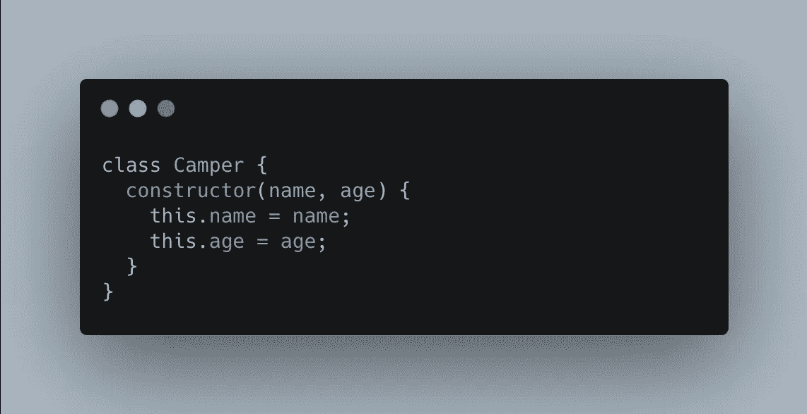
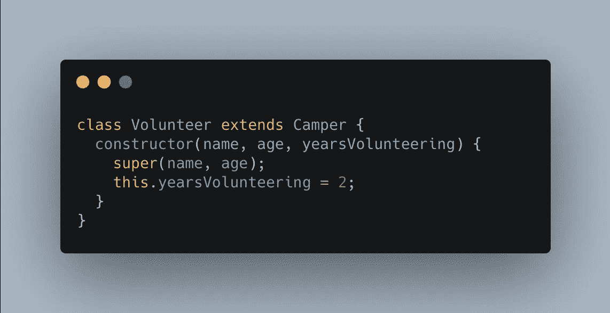
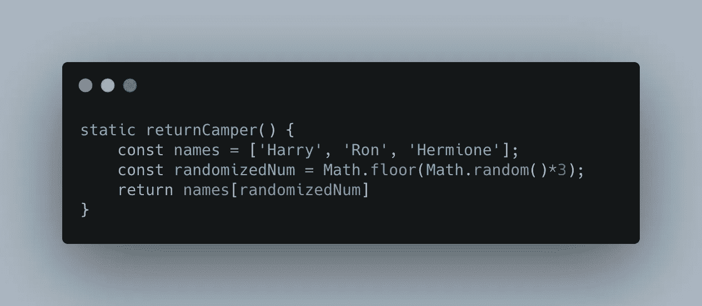

# JavaScript 类的一站式商店

> 原文：<https://medium.com/nerd-for-tech/your-one-stop-shop-for-javascript-classes-70bb4bd75504?source=collection_archive---------22----------------------->

如何设置它们+通过父类继承

对于那些不熟悉类和它们所提供的东西的人来说，类在面向对象编程中是至关重要的，以便创建包含状态值和方法的对象，从而在该类中创建某种行为。对象也由保存数据的键值对组成。您可能已经猜到了(或者已经知道了)，Javascript 是一种面向对象的编程语言！

## 类是用来做什么的？

类是开发人员用来快速创建对象实例的工具。它们是保持代码干燥并减少重复代码机会的好方法。假设您正在经营一个夏令营，并且想要一种简单的方法来组织所有不同营员的数据。下面是一个 Camper 类的例子，在文章的后面，我们将讨论如何导航“父”类的继承。

## 让我们打破这一点！

*   Camper——Camper 是类的名称，类通常用 CamelCase 编写。
*   构造函数——这个构造函数方法将在任何时候创建一个新的 Camper 实例时调用，它将用一个名称为**的名字**和一个年龄为**的名字**来初始化。例如:**const new Camper = new Camper(" Sara "，10)。**然后，您可以像这样记录这个新实例:**console . log(new camper . name)**返回 **Sara** 。
*   在构造函数方法中，我们使用 **this** 关键字来引用该类的实例。

在类中，您可以设置任何您认为相关的 getter 方法，以便在类中创建某种行为或操纵数据。例如，您可以简单地创建一个返回露营者名字的方法，语法与您创建的任何对象相同。

## 遗产

但是，假设我们要扩充营员。我们想创建一个额外的组织，我们想把我们的营员分成志愿者和孩子。为了做到这一点(同样，不需要重复代码和保持干燥)，我们可以使用 implement 我们现有的 Camper 类作为父类**和父类**(又名超类)，我们的志愿者和孩子类作为子类**和子类**(又名子类)。换句话说，我们的子类将**从父类继承**属性(姓名、年龄)，以及父类的任何方法。然而，假设您的志愿者类有一个额外的属性，它不属于您的父 Camper 类。

你可能会注意到上面一些我们之前没有看到的新关键词。让我们来分解一下:

*   **扩展** —这将使“超类”(Camper)的方法在“子类”(志愿者)中可用。您将像平常一样设置构造函数。
*   **super**—super 关键字将调用父类的构造函数，在我们的例子中是 name 和 age，后面是该子类独有的任何新属性，在这个例子中是 yearsVolunteering。

## 静态方法

最后，我们将讨论静态方法。静态方法是可以从类中调用的方法，但不与该类中的任何特定实例相关联。例如:

由于关键字的原因，我们只能调用。returnCamper()方法，而不是父类的任何实例。

…这就是你想要的！希望这有助于您学习基础 Javascript 类，并为以后的学习打下良好的基础。