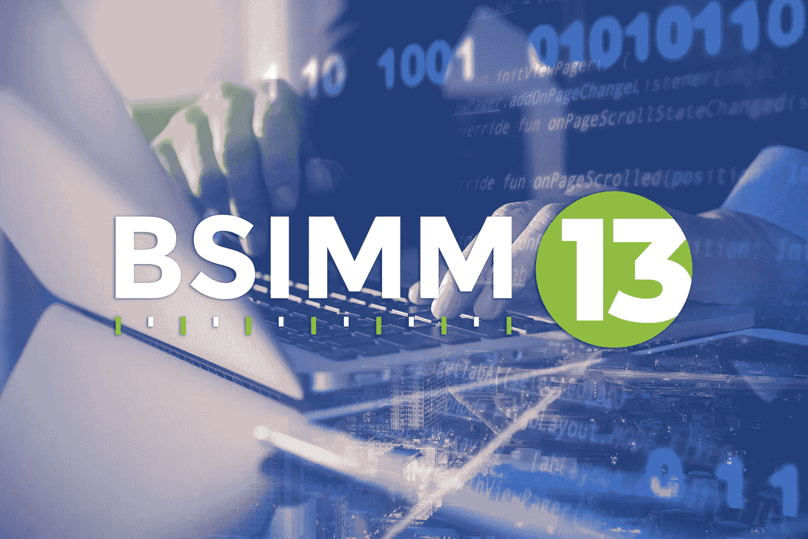

# 您的软件可以成就您，也可以毁灭您，这就是您需要 BSIMM 的原因

> 原文：<https://medium.com/nerd-for-tech/your-software-can-make-or-break-you-which-is-why-you-need-bsimm-c9ab2749b02e?source=collection_archive---------1----------------------->

如果你依赖软件——你确实如此——你需要 BSIMM。

原因如下。风险投资家、马赛克创始人、网景公司联合创始人马克·安德森[在 2011 年](https://www.wsj.com/articles/SB10001424053111903480904576512250915629460)写道:“软件正在吞噬世界”。我们所有人现在消费的更多的是——也许你可以打个比方说吃——软件。

它滋养和维系着我们生活中的一切，无论是数字的还是物质的。这个清单实际上是无止境的——能源、金融、通信、娱乐、休闲、医疗保健、教育、公用事业、交通、家电、家庭安全、农业等等——都是由软件运行的。

因此出现了一句准确的老话:每家企业都是软件企业。

这也是为什么它如此重要，就像食物一样，它不会中毒。如果运行在你的业务的几乎每一个元素上的软件，从关键的到琐碎的，都有可以被网络罪犯利用的漏洞，那么这种滋养就会变成恶性的。它可能会破坏你的财务状况，掏空你的市场份额，让你陷入法律危机，甚至威胁到你的生存。

因此需要 BSIMM。

是的，这是一个奇怪的缩写，但它是一个值得记忆的缩写。[在成熟度模型中构建安全性](https://www.bsimm.com/download.html?intcmp=sig-blog-bsimm13?cmp=pr-sig&utm_medium=referral)是一份年度报告的主题，这份报告现在已经是第 13 次了，它帮助组织在一个由软件运行的世界中最大化快乐，最小化痛苦。

披露:我为 Synopsys 软件完整性小组撰写文章，该小组制作 BSIMM 报告。但无论如何我都会写下来。我已经这样做了十多年——远在我来新思科技之前。

它的帮助方式是通过记录多个行业中的数十个组织如何提高他们的软件安全性，这比一家网络安全公司的几个专家(无论多么合格)的讲座更有分量。

更好的是，它也没有明确规定您应该做什么。它只是告诉你那些公司做了什么。最新的 BSIMM 报告依赖于八个垂直行业的 130 多名安全从业者详细(匿名)解释他们自己的软件安全计划(SSI)——哪些有效，哪些无效，风险和威胁有哪些变化，以及他们如何应对这些变化以建立对他们软件的信任。

**多条路线，共同目的地**

这就是为什么 BSIMM 报告将自己描述为一个免费的“路线图”，以帮助组织提高他们构建、销售和使用的软件产品的安全性——因为没有单一的最佳途径来提高安全性。事实上，路线图的整体思想是显示通往目的地的多条路线，而不指定走哪一条。

然而，所有人的目的都是一样的，可以归结为一两句话:在软件中构建安全性，这样它就可以被信任。然后做任何必要的事情来保持这种信任。如上所述，虽然 BSIMM 并不决定任何组织采取的路线，但它确实会进行评估，以评估组织在通往目标的旅程中取得的进展，即安全成熟度。

当然，这样做需要时间、金钱和员工的专业知识。BSIMM 报告跟踪其参与组织的 120 多项“活动”，包括使用多种自动化测试工具在软件开发生命周期(SDLC)中发现缺陷、履行隐私义务、遵守安全标准，以及跟踪和保护软件组件供应链。

对所有这些的需求应该是显而易见的:软件风险是业务风险——潜在的生存风险。正如每日头条提醒我们的那样，如果黑客可以利用软件中的设计缺陷、bug 和其他缺陷，他们就可以窃取知识产权、窃取员工和客户的个人信息、突袭公司银行账户、破坏建筑物的物理安全、通过勒索软件攻击破坏组织的运营等等。

此外，网络犯罪分子永远在进化和改进他们攻击目标的方式。因此，防御也必须不断发展，这就是为什么 BSIMM 报告每年更新一次，以反映这种发展的趋势以及在软件中建立信任所涉及的许多细节。

**热门趋势**

一个主要的例子:BSIMM13 中提到的一个主要趋势是对开源软件和软件供应链的安全性的日益关注。

就在几年前，这些还是安全社区的边缘话题。现在，它们是私营和公共部门的重中之重。它们是拜登总统 2021 年 5 月关于[改善国家网络安全](https://www.federalregister.gov/documents/2021/05/17/2021-10460/improving-the-nations-cybersecurity)的行政命令以及此后发布的多份联邦指导文件的关键要素。

他们是最受关注的，这是有充分理由的。正如 Synopsys 的另一份报告“[开源安全和风险分析](https://www.synopsys.com/software-integrity/resources/analyst-reports/open-source-security-risk-analysis.html)”所记录的那样，第三方软件——开源和商业软件——几乎存在于每一个代码库中，并且构成了其中的绝大部分

BSIMM13 指出的一个令人鼓舞的趋势是，73%接受调查的网络安全专业人士已经[加大了保护其供应链的力度](https://www.synopsys.com/software-integrity/resources/analyst-reports/gitops-and-shift-left-security.html)。这意味着如果你还没有这样做，你应该开始了。

一种方法是使用自动化的[软件组合分析](https://www.synopsys.com/software-integrity/security-testing/software-composition-analysis.html)工具，它有助于在代码库中找到开源组件，以及这些组件中任何已知的缺陷和许可冲突。

另一个是创建和维护一个[软件材料清单](https://www.synopsys.com/blogs/software-security/building-sbom-with-black-duck/) (SBOM)，它在代码库中识别第三方软件，这样一个组织就可以对任何这些组件中的漏洞的任何新披露做出快速响应。

BSIMM13 发现创建 SBOM 的组织增加了 30%,这反映了对软件供应链风险意识的增强，更不用说即将到来的要求(Biden EO 中的命令之一)了，即任何出售给联邦机构的软件产品都必须附带 SBOM。

它还发现，要求软件供应商满足这些安全标准的组织增加了 50%。

在 BSIMM13 中观察到的其他趋势包括

*   **从“左移”移动到“随处移动**”虽然 BSIMM 在早期创造的术语“左移”咒语旨在鼓励组织在 SDLC 中更早地开始他们的安全测试，但它从未被如此字面地理解为意味着只左移*只剩*了。新思科技的首席科学家萨米·米格斯(Sammy Migues)说，“我们真正的意思是，一旦安全控制活动所依赖的文物可用，就以最高的保真度尽快开展这项活动，”自 BSIMM 报告开始以来，萨米·米格斯一直是该报告的合著者。换句话说，这意味着在自动化工具(如[智能编排](https://www.synopsys.com/software-integrity/polaris/intelligent-orchestration.html))的帮助下，在正确的时间进行正确的测试，这可以在 SDLC 期间实现连续的缺陷发现，这是手动不可能做到的。
*   在 SDLC 中使用更小的自动化检查。这是“随处转移”的另一个要素，它帮助开发人员在花费最少时间和金钱的情况下找到并修复缺陷。几年前，开放 Web 应用安全项目引用了美国国家标准与技术研究所、IBM 和 Gartner 的报告，称在设计阶段(SDLC 的开始)修复应用安全漏洞的成本比在生产阶段(结束)低 30 到 60 倍。谈论对抗通货膨胀的一个显而易见的方法。
*   **从错误中学习**。比简单地修复软件错误更好的方法是理解错误是如何产生的，然后建立防止它们的方法。BSIMM13 发现，70%的参与者正在设置相当于自动化护栏的东西——策略即代码，确保编写代码的唯一方式是安全的方式。
*   **增强容器安全性的编排。**这是指使用自动化和智能编排来监控容器中的应用程序的错误配置和不符合性。BSIMM13 观察到“为容器和虚拟化环境使用流程编排”活动增加了近 30%。

当然，如果你要完成这些和许多其他的任务，有人(更可能是一群人)必须负责完成它们。因此需要一个软件安全组(SSG)，它可以从一个人开始，但通常需要一个团队才能成功。

BSIMM13 发现，130 个参与组织中没有一个组织的 SSG 具有完全相同的结构，但它们有几个共同点，包括它们组织起来提供软件安全服务，设置并验证策略的遵守情况，并且它们围绕管理跨开发或工程组织从事软件安全工作的专家团队进行组织。

大多数 SSG 也培养“安全冠军”——这些人不是安全团队的直接成员，但对软件安全感兴趣，并愿意在团队层面推广它。

冠军可以包括构建代码的开发人员、软件架构师、测试人员、操作团队、经理和执行团队——甚至是保护软件供应链的关键环节的外部供应商。

这样做的价值在另一个趋势中显而易见——平均而言，拥有安全冠军的公司在 BSIMM 评估中的得分比没有安全冠军的公司平均高 35%。

每份 BSIMM 报告的总体信息是，安全成熟度是一个旅程，而不是一个事件(又一个“路线图”典故)。但是 BSIMM 参与者社区可以帮助您开始这一旅程，并更快地到达您想要和需要的目的地。

也不需要先存些现金。完整的报告是免费的，可以在知识共享署名-共享 3.0 许可下获得。此许可证的副本在此处[。](http://creativecommons.org/licenses/by-sa/3.0/legalcode)