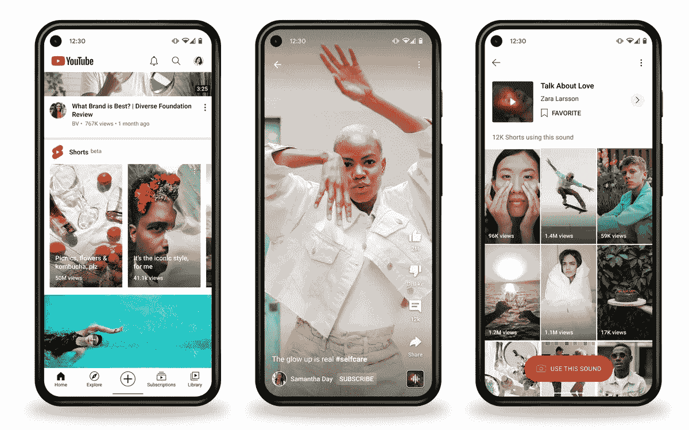
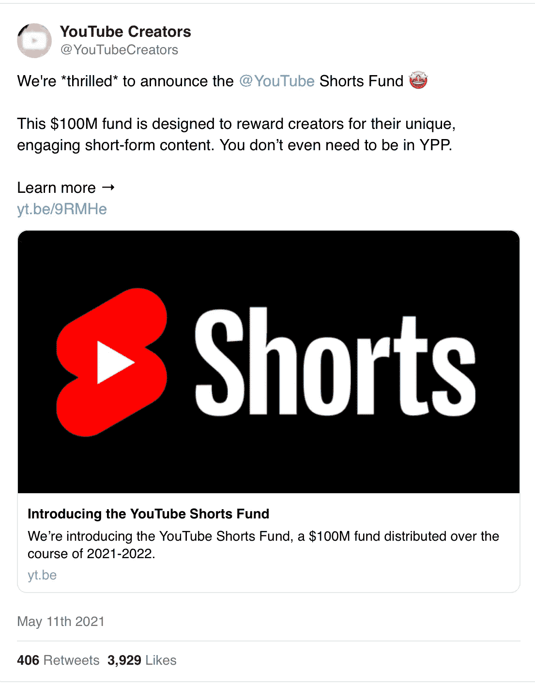
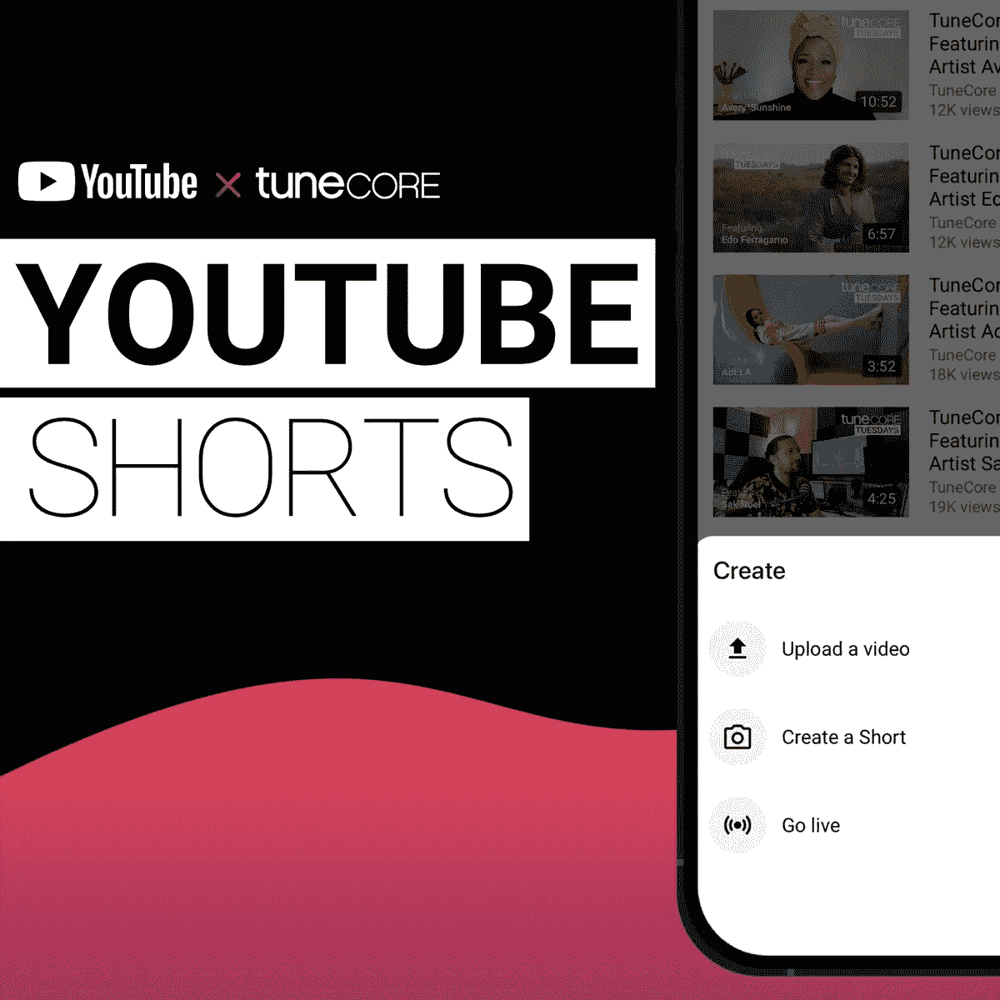
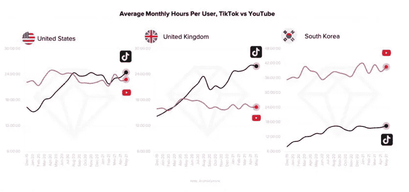

# 🎥YouTube 短片在 100 多个国家推出

> 原文：<https://medium.com/nerd-for-tech/youtube-shorts-launches-in-100-plus-countries-b075c453c14a?source=collection_archive---------16----------------------->

我们写了一份关于音乐及其背后的商业和技术的每日时事通讯。如果您想直接在您的收件箱中获得它，请立即订阅 [***！***](https://incentify.substack.com)

什么是好的，人们？

昨天，总部位于硅谷的科技巨头和视频流媒体平台 **YouTube** 在全球推出了 **YouTube Shorts** ，试图利用短格式、可共享剪辑的日益流行——这种格式推动了抖音的大规模增长。

这是怎么冒出来的？

谷歌拥有价值 1700 亿美元的平台，最初于 2020 年 9 月在印度推出 YouTube 短片，并于今年春天将该功能扩展到 26 个国家，包括美国。

从本周开始，它将向全球 100 多个可以使用 YouTube 的国家推出 YouTube 短片。

到目前为止反响如何？

根据谷歌的数据，仅在 2021 年 3 月，短裤**就产生了 65 亿的日浏览量**。

全球扩张承诺将进一步推动这一数字，因为 YouTube 仍然没有谈论关于插入广告或为短裤引入其他货币化选择的计划，这在不久的将来似乎是显而易见的。

传统上被认为是视频创作者友好的，并且有强大的网络效应支持，YouTube 计划利用其现有的每月 23 亿活跃用户的基础，让他们开始消费和创建短片视频内容。

最精彩的部分？

5 月，它宣布了 YouTube 短片基金，承诺向最吸引人的短片创作者发放 1 亿美元，预计将于 2021 年秋季开始，持续到 2022 年。

那么，该产品与抖音和 Instagram Reels 等竞争对手相比如何呢？🤔

目前， **YouTube Shorts 允许用户录制长达 60 秒的视频**。抖音最近宣布将单个短片的最大长度从 60 秒延长到 3 分钟。

像抖音一样，YouTube Shorts 提供了像多段相机这样的功能📸将多个视频剪辑串在一起，录制音乐的能力🎧，并控制速度设置▶️

创作者还可以在视频中的特定点添加文本，从其他短片中采样音频以重新混合到他们自己的剪辑中，从手机的相机胶卷中添加剪辑，并为色彩校正视频添加基本滤镜。

我可以继续说下去，但你们明白了。

看看 YouTube 的官方视频解释它是如何工作的👇🏻

[https://youtu.be/9EJIH8kxTn8](https://youtu.be/9EJIH8kxTn8)

该平台的地理扩张是在 5 月份的新闻之后，DIY 发行公司 **TuneCore** 及其总部位于巴黎的母公司**认为**已经与 YouTube 合作，为短片提供音乐。

YouTube 全球音乐主管 Lyor Cohen 说:

> “YouTube 帮助各代艺术家向世界各地的音乐迷展示他们的作品目录。***“YouTube Shorts 是一个快速发展的平台的下一个重要前沿，这个平台以连接艺术家和粉丝为中心，围绕着对音乐的热爱。** “我很兴奋地看到 YouTube 社区的创造力将旧的最爱重新组合成新的，同时发现他们最终无疑会喜欢的艺术家的新音乐。*

**

*TuneCore 在 5 月份宣布，他们所有的艺术家都将在 YouTube 短片上播放音乐*

*YouTube 正计划让它真正与抖音和 Instagram Reels 正面交锋，以期从创作者经济中分得一杯羹。*

*但是为什么 YouTube 现在要介入这件事呢？*

*抖音正紧紧盯着它，这是怎么回事😅 👇🏻*

**

*与 YouTube 相比，美国和英国认为抖音占据了用户的注意力。*

*[分析公司](https://www.musicbusinessworldwide.com/tiktok-is-parking-its-tanks-on-youtubes-lawn-as-report-says-its-users-are-more-engaged-than-its-rivals/) [App Annie](https://www.appannie.com/en/go/state-of-mobile-2021/) 最近发布的一份新报告显示，截至 2021 年 5 月，**抖音在美国和英国超过了 YouTube，人均每月花费在 Android 上的时间。***

*YouTube 的核心视频流产品彻底改变了世界消费视频内容的方式。*

*然而，短格式内容的兴起以及随之而来的注意力范围的缩小，尤其是在年轻一代中，**使得 YouTube 显然要从中分一杯羹。***

# *我们对此的看法？*

*大型科技公司现在已经深深陷入了一个典型的寡头垄断市场。*

*最初作为与朋友和同龄人联系的有趣工具，现在作为一群少数公司的集体价值数万亿美元，并且已经蚀刻到用户的日常生活和一般的流行文化中。*

*这些平台已经膨胀到如此程度，以至于自由言论现在被他们的条款所控制和监管，而像美国总统这样的人被禁止在 Twitter 上与他的 5000 多万观众交流，这只能显示大型技术对用户的控制。*

*那么，当 YouTube 推出短裤与抖音和 Instagram 竞争时，这对创作者来说重要吗？*

*也许是的——竞争只会带来产品的改进和更有吸引力的工具来帮助他们分发和货币化他们的内容。*

*对于用户来说，它仍然是另一个可供选择的社交媒体平台。*

*视频、刷屏和点赞的兔子洞；被算法控制着投入他们的时间和注意力，就像瘾君子渴望每天服用多巴胺一样💉*

**如果你喜欢这篇来自* [的时事通讯，为什么不和你喜欢的人分享呢？](https://incentify.substack.com)*

**P.S-关注我们的*[***insta gram***](https://www.instagram.com/clubincentify/)*和*[***Twitter***](https://twitter.com/clubincentify)**了解更多关于音乐和文化的内容，现在！***

***原载于*[*https://incentify.substack.com*](https://incentify.substack.com/p/-youtube-shorts-launches-in-100-plus)*。***