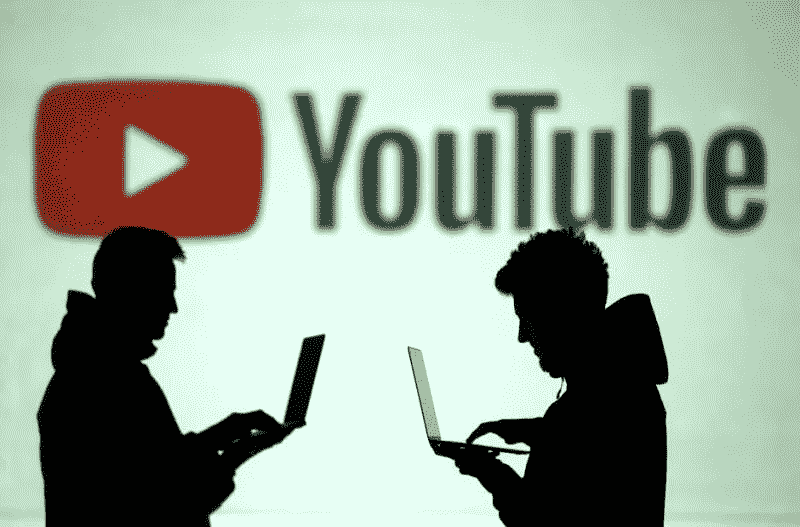
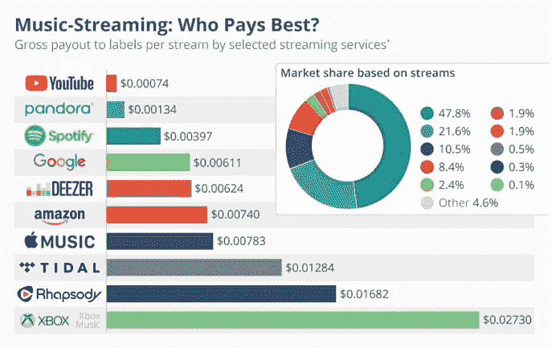
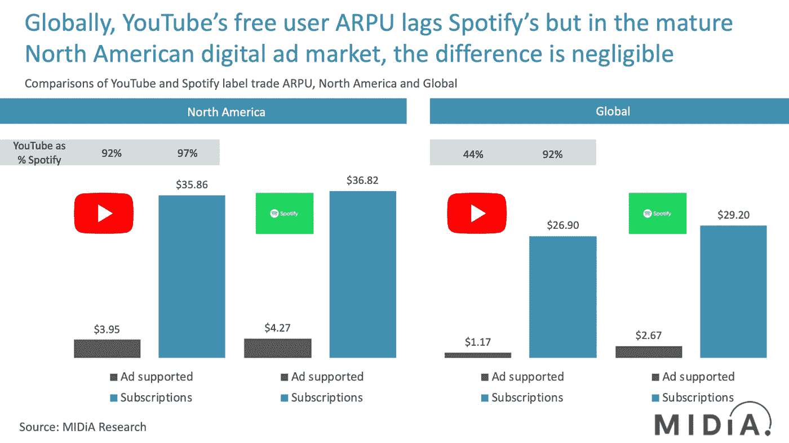

# 🎥YouTube 进入音乐行业的后门

> 原文：<https://medium.com/nerd-for-tech/youtubes-backdoor-into-the-music-industry-aad96fe22c04?source=collection_archive---------15----------------------->

我们写了一份关于音乐及其背后的商业和技术的每日时事通讯。如果您想直接在您的收件箱中获得它， [*现在就订阅吧！*](https://incentify.substack.com)

对大家有什么好处？

上周末，我偶然发现了一个有趣的案例，是关于 YouTube 多年来与音乐行业爱恨交加的关系的，在唐纳德·帕斯曼的书《关于音乐行业你需要知道的一切》中

YouTube 和音乐行业之间有什么过节？🤬

毕竟，YouTube 仍然是最大的音乐消费平台，即使在 Spotify、Apple Music 和 Amazon Music 等音乐流媒体平台出现这么多年之后。

例如，看看 YouTube 上有史以来点击率最高的视频，很明显音乐远远领先于其他类别👇🏻

尽管音乐产生了大量的观众，YouTube 支付给音乐产业的费用比其他任何流媒体平台都要低。

这是在它宣布在过去的 12 个月里向艺术家、词曲作者和版权所有者支付了价值 40 亿美元的版税之后。

相比之下，Spotify 仅在 2020 年就支付了 50 亿美元的版税。

这就是 YouTube 与其他流媒体平台竞争的方式👇🏻

与其他流媒体平台相比，YouTube 的付费最低

# 那么为什么从音乐中受益最大的平台付费最少呢？

从表面上看，很明显**由于 YouTube 是免费服务，它的收入模式主要依赖于广告**(除了新生的 YouTube 收费服务)

另一方面，Spotify 拥有广告和订阅的混合模式，而 Apple Music 则纯粹基于订阅。

**因此，Spotify 和 Apple Music 的 ARPU(每用户平均收入)高于 YouTube，因此支付的费用也更高🤷‍♂️**

Spotify 和 YouTube 的 ARPU 比较

然而，对流媒体行业历史的深入探究描绘了一幅不同的画面👇🏻

如果你做到了这一步，看起来你在挖掘我们的内容！请分享这一点，并帮助支持我们继续创造更多这样的内容🙏🏻

YouTube 逍遥法外的原因是版权法中一个被称为“安全港”的怪癖，这个怪癖多年来一直帮助他们从音乐中获益。

# 什么是安全港？

一部具有历史意义的 [**数字千年版权法案(DMCA)**](https://en.wikipedia.org/wiki/Digital_Millennium_Copyright_Act) 📝**安全港规则于 1998 年通过，使数字服务提供商不必为在其平台上发布侵犯版权的内容承担责任，如果它没有创建、发布或知道它是侵权的。**

为什么这样

嗯，如此多的内容通过任何数字服务提供商(如 YouTube)的管道，以至于**不可能跟踪和控制他们每个人都发布了什么**👨🏻‍💻

然而，如果版权所有者将内容标记为侵权，DSP 有责任将其删除。

**够公平吧？这一切都很好，直到 YouTube 出现。**

突然间，数百万个视频开始被上传到 YouTube 上，即使他们把它弄掉了，也会有数千个类似的视频再次出现。

一再地🔁

这是真的，直到 2007 年 3 月**美国媒体集团维亚康姆对 YouTube 提起了******10 亿美元的诉讼**，在经过大量立法后，最终在 2013 年通过了有利于 YouTube 的法案，因为法院裁定它并没有真正控制其平台上的内容。**

**长话短说？**

# **当谈到控制 YouTube 时，音乐行业什么也做不了🤷‍♂️**

**在维亚康姆诉讼失败后，这个行业简单地决定给 YouTube 一个许可证，因为每个人都认为有总比没有好，因此 YouTube 最终支付了所有流媒体服务加起来最少的费用。**

**虽然他们推出了 **YouTube Music，一个基于订阅的平台，每月 9.99 美元**，但它仍然只有**3000 万订户**，远远落后于 Spotify 和 Apple Music。**

**虽然有传言称安全港法将在欧盟被废除，但在任何事情成为官方消息之前，YouTube 进入音乐领域的后门仍将保持开放🚪**

**如果你喜欢这篇来自 [Incentify](https://incentify.substack.com) *的时事通讯，为什么不与你喜欢的人分享呢？***

***P.S-关注我们的*[*insta gram*](https://www.instagram.com/clubincentify/)*和*[*Twitter*](https://twitter.com/clubincentify)*了解更多关于音乐和文化的内容，现在！***

***原载于 2021 年 8 月 11 日 https://incentify.substack.com***。****