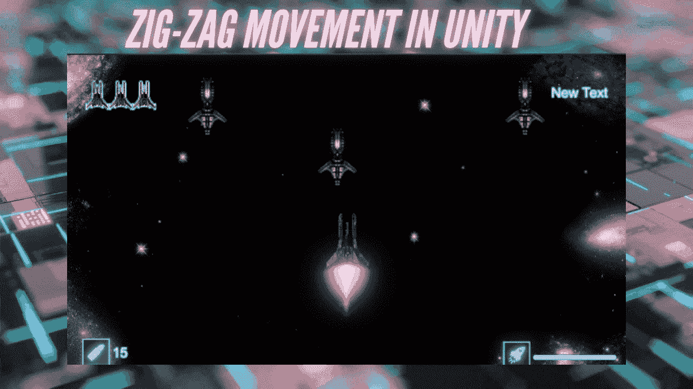
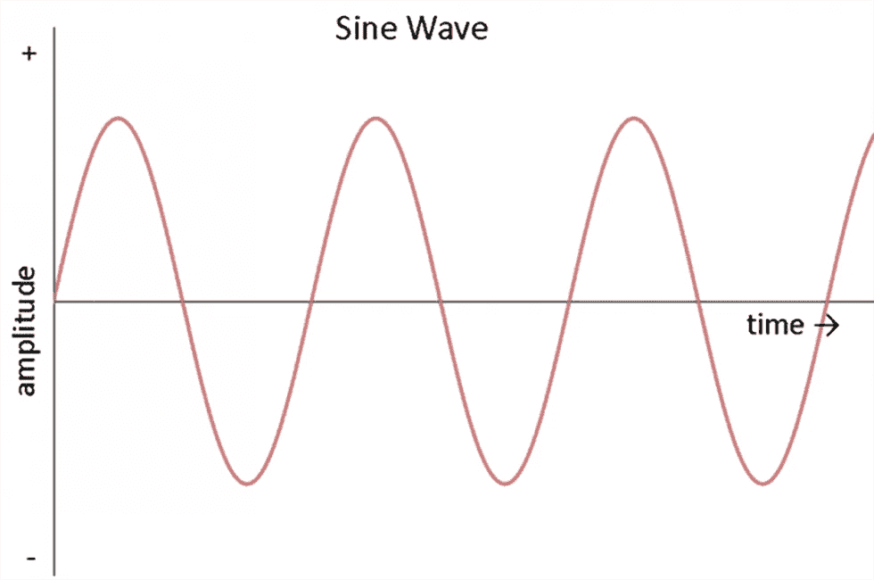
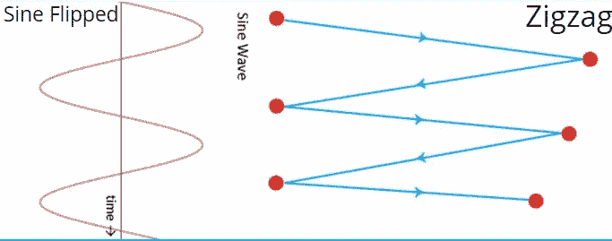
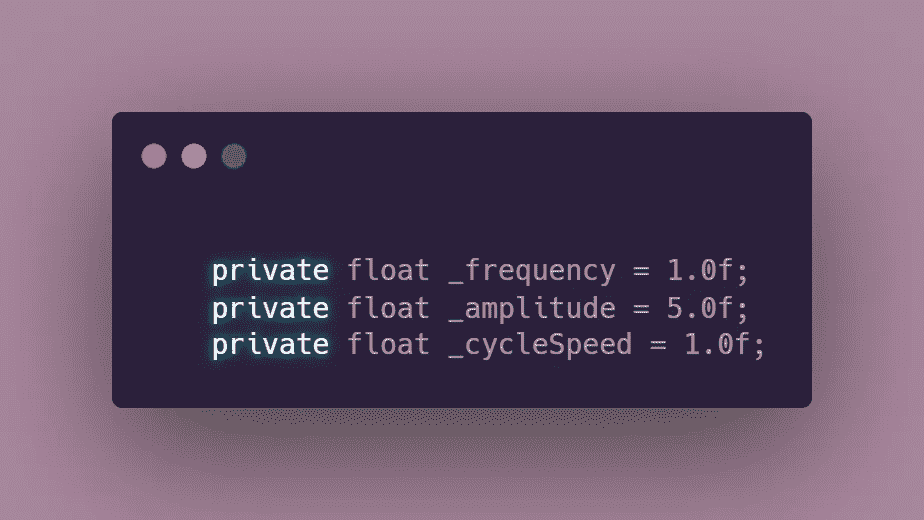
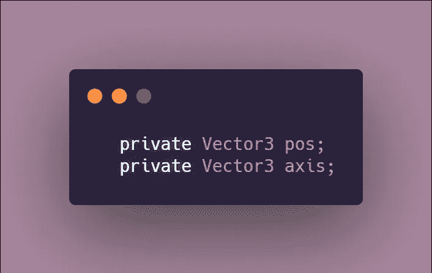
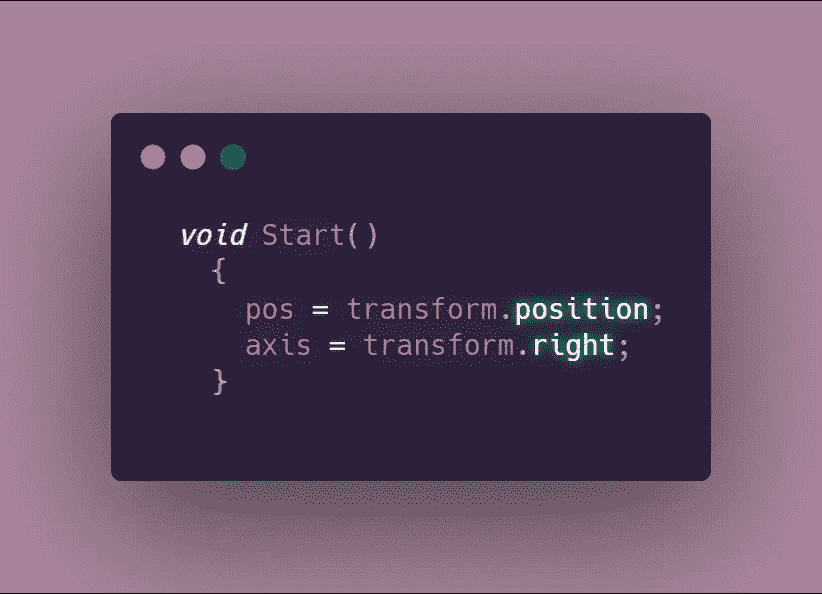
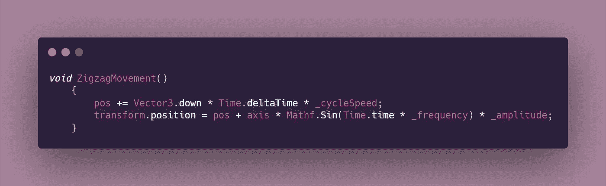
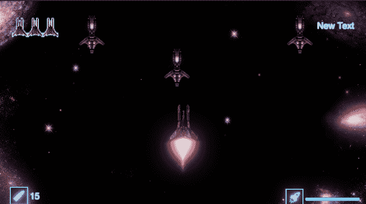

# 团结中的曲折运动

> 原文：<https://medium.com/nerd-for-tech/zig-zag-movement-in-unity-3c2762b1be61?source=collection_archive---------7----------------------->

## 2D 太空射手—第二阶段:核心程序设计挑战

**目标**:使用数学正弦波以之字形移动物体。

# 为什么使用正弦波？

如果你观察正弦波的结构，你会发现它遵循着与锯齿形运动相同的模式。如下图所示，如果我们翻转正弦波，这一点会变得更加明显。

**规则正弦波:**

[将正弦波内化](https://alearningaday.blog/2019/12/06/internalizing-the-sine-wave/)

**对比:**

## 正弦波的特性以及它们如何转化为代码

正弦波由多种属性组成，我们将看看其中的三种，它们将是我们代码的主要变量的一部分。

*   **频率:**正弦波的[频率](https://www.mathopenref.com/trigsinewaves.html#:~:text=The%20frequency%20of%20a%20sine,about%20one%20cycle%20per%20second.&text=In%20this%20formula%20the%20frequency%20is%20w.)是**每秒发生的完整周期数**。为了简化这个术语，我们可以把它想成波浪形/之字形运动的**速度**。
*   **振幅:**[振幅](https://www.dummies.com/education/math/trigonometry/graph-a-sine-function-using-amplitude/#:~:text=In%20other%20words%2C%20the%20amplitude,sine%20function%20by%20a%20number.)是从最低值到最高值的**距离**的一半。

你可以把它想成“**这个之字形运动**有多宽？”运动是发生在一个小空间还是物体被允许覆盖更大的区域？

*   **时间**:测量完成循环所需的秒数。出于我们代码的目的，我们可以使用 Unity 的 [**Time.time**](https://docs.unity3d.com/ScriptReference/Time-time.html) 。这将乘以一个额外的**速度变量**，以控制对象在遵循锯齿形模式时的移动速度。

# 之字形运动编程

1.  为以下内容声明全局变量:

> **注意**:你可以根据自己的想法修改这些值，这些只是我个人对我想要的物体移动方式的选择。

2.创建两个 Vector3 变量:一个用于对象的位置，另一个用于轴。

3.在 Start 函数中，为两个新添加的变量设置值，作为我们的 zigzag 参数。

4.创建一个方法来存储运动逻辑。

*   **位置**将按帧连续计算，并乘以循环速度。
*   **转换**将考虑 pos，并使用 [Mathf。Sin](https://docs.unity3d.com/ScriptReference/Mathf.Sin.html) 产生波。
*   正弦波是按照正弦的[三角函数的逻辑产生的。幸运的是，Unity 的 Mathf 类提供了一组常见的数学函数，包括三角函数。](https://www.intmath.com/trigonometric-graphs/2-graphs-sine-cosine-period.php)

5.从 Update 函数中调用 ZigzagMovement 方法，现在您应该有了一个功能齐全的移动逻辑。

**结果:**

终于从 GameDevHQ 回来并解决一些核心编程挑战了！接下来的文章将继续讨论敌人的类型和行为，以及其他话题！