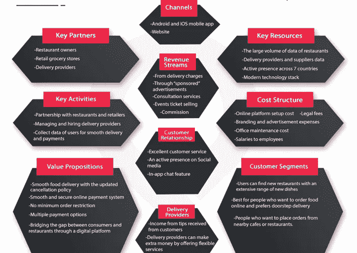
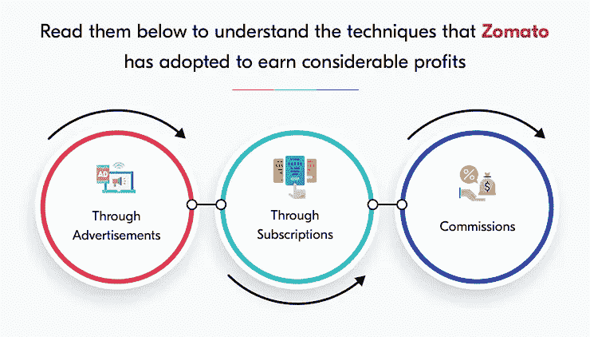

# Zomato 商业模式——支持建立成功的食品配送帝国

> 原文：<https://medium.com/nerd-for-tech/zomato-business-model-support-to-build-successful-food-delivery-empire-bd99fdc100bc?source=collection_archive---------1----------------------->

食品配送

今天，送餐业务已经成为一个繁荣的帝国。这得益于在线订餐和在线送餐应用的出现。据《应用商业》报道，该解决方案将彻底改变整个行业，并使收入在 2029 年达到 3200 亿美元。

如果你访问 iOS 或 Android 市场，你会遇到允许无缝食品配送服务的应用程序，如 Swiggy、UberEats 和 Zomato 等。在这里，我们将讨论 Zomato 及其受欢迎程度。

当你阅读这篇文章时，你会深入了解这个在线食品交付应用程序以如此迅猛的速度增长的原因。这是通过了解这家食品配送巨头所采用的商业模式。这些人负责利用在线[送餐](https://www.peppyocean.com/food-ordering-delivery-app-development/)应用程序开发服务的新业务。这是为了产生一个强大的送餐帝国。

让我们在下面的栏目中了解这家广受欢迎的食品配送巨头。这将有助于你衡量它的受欢迎程度。

# 向你介绍佐马托

查看下面的时间线，了解佐马托的简史。

> **2008 年:美食湾成立**
> 
> **2010 年:种子融资&更名为 Zomato**
> 
> **2012:发达的国际空间**
> 
> **2015 年:推出送餐服务**
> 
> **2017 年:推出 Zomato Gold**
> 
> **2018:推出超纯**
> 
> **2019:推出 Zomaland**
> 
> **2020 年:收购 UberEats**
> 
> **2021 年:第 13 个转折& IPO 启动**

通过上面的时间线，你可以深入了解这款送餐 app 的寿命。你知道它为什么受欢迎吗？

请在下面的行中查看它们，以了解原因。

# Zomato 受欢迎的原因

1.  **易于操作**

Zomato 非常容易使用。它只要求用户访问在线订餐应用程序，并添加他们的位置信息。执行该步骤后，他们将获得附近餐馆的列表。用户可以点击从列表中选择餐馆。

在打字时，他们会得到一份提供该餐的餐馆列表。他们现在可以在将一餐或多餐添加到购物车并从不同的可用支付选项中选择支付模式后下单。餐厅接受并确认订单。餐馆里的人聚在一起准备饭菜。提货请求与送货司机共享。收到这个请求后，他们(送货司机)到达餐厅，取餐，然后踏上送货的旅程。

**注意** —用户在交付的不同阶段都保持警觉。

**2。其独特的商业模式**

如果我们必须分解使 Zomato 独一无二的因素，那就是他们向消费者提供的有吸引力的折扣。这是一件如果从商业角度分析可能不会有利可图的事情。

请看下图，了解这家食品配送巨头赚取收入的不同方式

图片来源——elluminatiinc.com

确保顾客在家门口快速送餐，让他们免去了长时间等待用餐的痛苦。被阿联酋、斯里兰卡、卡塔尔、英国、菲律宾、南非、巴西等国家使用。，该应用程序帮助餐馆老板提高了在线知名度。

由于该应用程序和食品配送巨头的网站面板，食品配送中心可以灵活地以更好的方式联系他们的客户。接下来，顾客可以灵活地快速获得送货上门服务，免去等待用餐的痛苦。很容易访问与餐馆和评论相关的信息。这有助于顾客正确选择下订单的理想地点。

**3。不同的客户群**

三个细分市场——用户、送货司机和当地餐馆。通过使用他们的服务，每个人都以不同的方式受益。

**如何？**

*   用户可以灵活地查看附近的餐馆，无缝订餐，并获得送货上门服务。
*   当地餐馆老板在网上建立知名度并推广菜单。这是为了吸引顾客。
*   送货服务提供者获得了提供送货服务的工作机会，并通过它获得了丰厚的收入。

**除了上面提到的原因，其他导致它受欢迎的原因还有-**

*   专注于 QAAA 模式，深入研究提供不同的客户群质量和可及性，Zomato 的服务是独一无二的。
*   致力于提供价格合理的食品配送服务，而不影响质量
*   允许客户轻松做出明智的选择，确保它们尽可能具有可读性。

通过以上这些因素，您可以深入了解 Zomato 成为顾客点餐和送货上门首选的原因。

现在，我们将思考这家食品配送巨头赚取收入的策略。这是一个需要重点关注的重要领域。这有助于获得他们所采用的技术知识，从而获得可观的利润。

# Zomato 收入模型

Zomato 开始了让顾客轻松获得食品配送服务并建立强大业务的旅程。他们遵循一些技术来获利。

*   **通过广告:**通过向餐厅提供广告政策，通过广告，赚取超过 70%的利润是很容易实现的。这是通过让餐馆灵活地获得食品交付巨头的横幅，以允许在线可见性的不断增长。
*   **通过订阅:**使用先进的工具和软件，Zomato 可以进行用户行为预测。这包括分析用户的搜索模式——他们搜索最多和最少的项目。收到这些信息后，餐馆老板会根据这些需求提供量身定制的服务。这是在向 Zomato 支付这些费用之后。
*   **佣金:**佐马托从顾客点餐的餐厅收取 20%至 25%的佣金。这一比率在 5%至 7%之间变动，有利于这家食品配送巨头赚取可观的收入。

通过所有这些方法，Zomato 有可能获得可观的收入和利润。它一直是新的食品配送创业公司的灵感来源。他们得到了鼓励，使用 Zomato 克隆应用程序来建立一个成功的食品配送帝国。

请阅读下面的解决方案，了解其在改变食品配送服务方式方面的有益作用。

# 关于 Zomato 克隆应用的一切

对于想要在食品配送服务领域站稳脚跟的企业家来说， [Zomato clone](https://www.peppyocean.com/zomato-clone-app/) 应用程序是实现这一目标的解决方案。可定制，并包含最佳的功能集。它允许食品配送初创公司根据其企业不断变化的需求修改应用程序，并为客户提供独特的食品配送体验。它使用 Zomato 克隆脚本构建，带有白色标签，帮助企业建立一个成功的食品配送帝国。这使得风险企业可以方便地处理大量的用户和订单。

# 包扎

佐马托对食品配送业务给予了过多的帮助，使其变得有利可图，欣欣向荣。除了坚持创收技术之外，客户拓展率高、独特的商业模式使 Zomato 成为新的食品配送创业公司的灵感来源。这给了他们采用 Zomato 克隆应用程序来扩展业务的力量。接下来是获得服务多个用户及其订单的能力。

这是你作为一个崭露头角的食品配送企业主，应该利用太多。立即从值得信赖的在线订餐应用程序开发公司获得解决方案。最终解决方案将使您能够更好地为客户服务。这最终将使企业从第一天起就获得最大的投资回报！