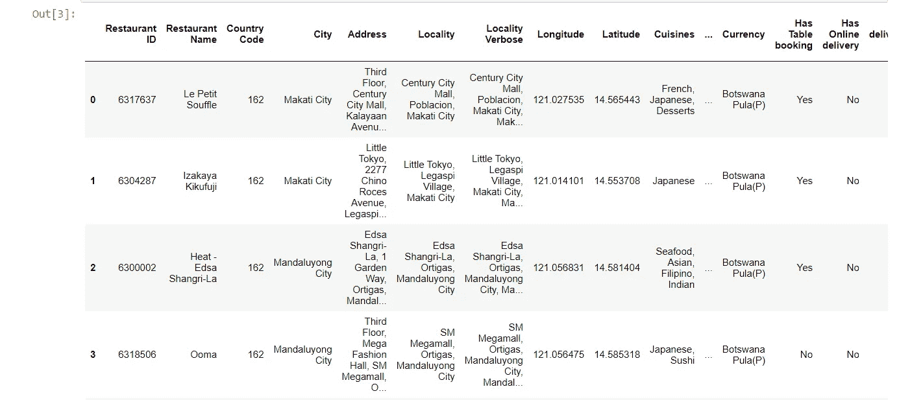
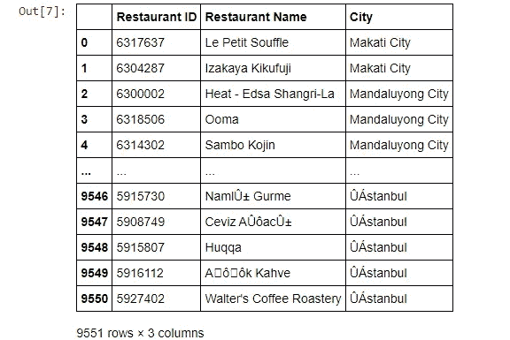
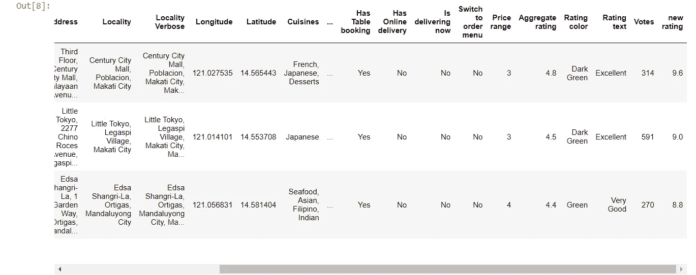
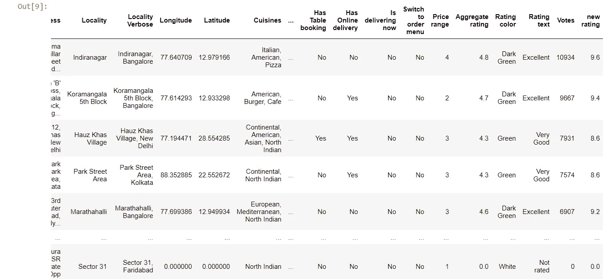
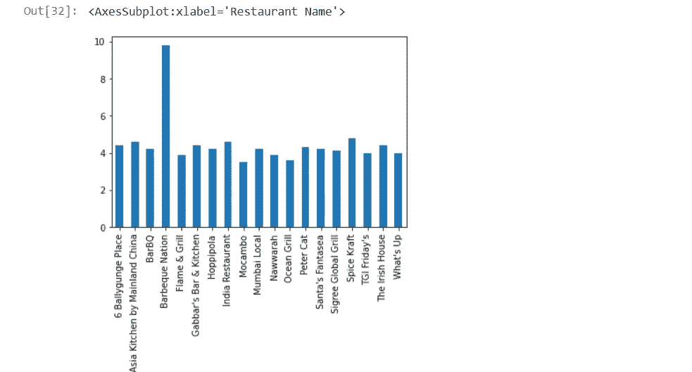

# 使用 Jupyter 笔记本进行 Zomato 数据分析

> 原文：<https://medium.com/nerd-for-tech/zomato-data-analysis-with-jupyter-notebook-6116ea03bd9d?source=collection_archive---------2----------------------->

## 使用 pandas、NumPy、seaborn 和 matplotlib 库对 Zomato 进行数据分析。

你好，数据科学家..！！

如今数据非常重要。因为数据包含重要信息，我们生活在信息时代。既然我们得到了数据，现在就看我们如何利用它了。


佐马托数据分析

假设你得到了公司的数据。在这些数据的帮助下，你可以更多地了解公司，比如员工的表现，哪个部门正在蓬勃发展，哪个部门正在落后，资金分布图，以及绩效分析。在数据科学中，我们处理这类问题。

我们将处理 Zomato 的数据，我们将对它了解得更多。所以，喝杯咖啡，让我们开始吧。

# Zomata 数据分析

我们将经历这些主要步骤:

1.  导入库
2.  加载数据
3.  分析数据

**导入库**

```
import numpy as np
import pandas as pd
import matplotlib.pyplot as plt
import seaborn as sns
```

将这些库导入 Jupyter 笔记本或 Google Colab，因为我们将在代码中使用它们。

```
zomato=pd.read_csv('D:\Data Science\Zomato\Dataset\zomato.csv', encoding='latin-1')
zomato.head(6)
```

导入 CSV 数据文件。我将在本文末尾提供数据集的链接。使用上面代码片段中的第二行代码来看看我们得到的数据。我们正在查看 Zomato 数据集的前 6 个数据视图。如果你想查看底部的 6 个字符，你可以把代码写成***【zomato . tail(6)***

您将在屏幕上看到类似这样的内容。



```
zomato.shape
zomato.columns
zomato.info()
```

第一行代码将给出行数和列数的信息。在该数据中，有 9551 行和 21 列。

zomato.columns 将给出所有 21 个列的名称。

zomato.info()将给出所有列的详细信息。比如，每一列中的属性数量以及这些属性的类型。

现在，假设在给定的数据中，您只需要餐馆 ID、餐馆名称和它所属的城市。这是一条有价值的信息。你怎么能这样做？

```
zomato[['Restaurant ID', 'Restaurant Name', 'City']]
```



当你运行这个单元时，你会得到一个类似这样的输出。

现在让我们假设您想要添加一列新的评级。目前，我们有综合评分，在这方面，项目评分为 5 分。但是在新的评分中，您希望给该项目打满分。换句话说，对于新的评级，我们希望将总评级提高一倍。怎么做呢？在您的单元格中添加以下代码片段。

```
zomato['new rating'] = zomato['Aggregate rating']*2
zomato.head(3)
```



如你所见，最后增加了一个新的栏目。此栏显示新的评级数据。

现在，让我们假设你的老板让你根据最高票数对餐馆进行升序排序。很简单的一个。让我们看看如何做到这一点。

```
zomato.sort_values('Votes', ascending=False)
```



如你所见，我们将得票最高的餐厅放在了最上面。

现在，让我们来看看佐马托的 10 大美食。

```
zomato['Cuisines'].value_counts().head(10)
```

当你运行单元格时，你会在顶部看到北印度食物。

现在让我们假设，您想要绘制一个仅基于聚合评论的 Kolkata 市餐馆条形图。

```
restt = zomato['City']=='Kolkata'
zomato[restt].groupby('Restaurant Name')['Aggregate rating'].agg('sum').plot(kind='bar')
```



你会在屏幕上看到这样的东西。烧烤国家的图形很奇怪。你能告诉我为什么吗？请在评论区告诉我。

同样，你也可以去佐马托进行城市数据分析。从数据中获取信息非常有趣。你可以深入挖掘。如今，无论是从个人还是公司的角度来看，每条信息都是有价值的。

你可以从 [**这里**](https://github.com/imrohit007/Zomato-Data-Analysis) **下载 zomato 的**数据集。****

这个项目的 Github 代码在这里是[](https://github.com/imrohit007/Zomato-Data-Analysis)****。****

**嗯，就是这样。感谢您的阅读。如果这篇文章内容丰富，那么一定要鼓掌并与你的社区分享。**